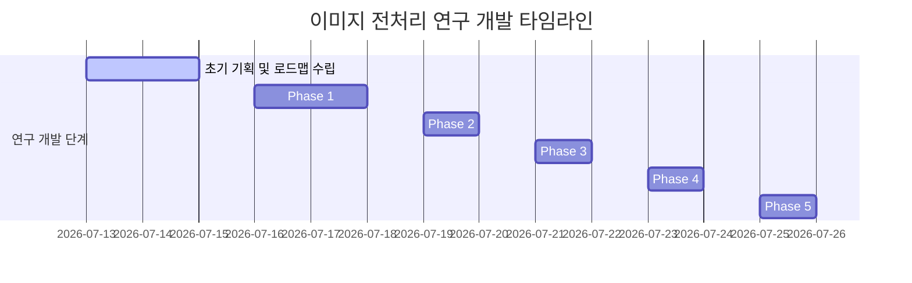

# 서울대 AI 챌린지 최종 보고서 가이드라인 — [데이터 전처리 & 이미지 물리 분석 부문]

본 가이드라인은 서울대학교 AI 챌린지 프로젝트 보고서 중 **[데이터 전처리 및 이미지 물리 분석 (Data Preprocessing & Image Physics Analysis)]** 파트를 학술 논문 및 고성능 모델링 보고서 수준으로 서술할 수 있도록 정리한 가이드라인입니다. 

실제 깃허브 저장소의 Preprocessing 관련 파일 분석 결과와 대화 이력 속의 핵심 고민(CLIP 특징 추출, 카메라 물리 역법칙, 트래커 오탐지 및 최종 기각 사유)을 종합하여 보고서 파트별로 바로 인용할 수 있는 최적의 뼈대와 실측 데이터를 제공합니다.

---

## 1. 배경 및 문제 정의 (Background & Problem Definition)

### 📌 개요
* **다중 프레임 비디오 정렬(Frame Ordering)의 한계**: 단순히 비주얼 모델을 파인튜닝하는 것만으로는 캡션에 묘사된 미세한 동작 흐름("줌아웃", "오른쪽으로 패닝", "서서히 다가옴")을 완벽히 모델링하기 어렵습니다.
* **시각-텍스트 인과 고리(Visual-Textual Bridge) 구축**: 캡션의 동작 묘사 단어와 이미지 내 피사체의 공간 기하학적 수치($X, Y, Area$) 간의 시공간적 인과관계를 매핑하는 전처리 파이프라인을 설계하고자 하였습니다.

---

## 2. 시도된 이미지 전처리 & 물리 힌트 추출 방법론

### A. CLIP 기반 글로벌 장면 분할 (Global Scene Partitioning) — [우리의 논의 시초]
* **도입 배경 (시작점)**:
  * 본 대회 데이터셋에는 단일 카메라 숏뿐만 아니라, **동일 비디오 내에서 카메라 앵글이 갑자기 바뀌거나 완전히 다른 장면으로 전환되는 급격한 씬 컷(Scene Cuts)**이 다수 포함되어 있었습니다. (예: 붓글씨 쓰기 장면 ➡️ 갑자기 물건을 포장하는 장면으로 전환)
  * 장면 분할 없이 객체 추적기(Tracker)를 무작위로 적용하면, 서로 다른 두 장면 사이에서 대상 피사체의 궤적 좌표가 강제로 연결되어 **기하학적 수치가 왜곡되고 물리 정보가 오염되는 현상**이 발생했습니다.
  * 따라서, 이미지 시퀀스 내의 **장면 그룹 경계면을 수학적으로 자동 감지**하는 기법이 전처리 파이프라인의 필수적 근간으로 대두되었습니다.
* **방법론 (CLIP Cosine Distance)**:
  * 사전 학습된 비전-언어 결합 임베딩 모델인 `CLIP (ViT-B/32)`을 활용하여 4장 이미지 프레임 각각의 글로벌 시맨틱 특징 벡터($v_t$)를 추출합니다.
  * 인접한 프레임 간의 코사인 거리(Cosine Distance)를 계산하여 이미지 간의 유사도 변화량을 측정합니다:
    $$\text{Dist}(t, t+1) = 1 - \frac{v_t \cdot v_{t+1}}{\|v_t\| \|v_{t+1}\|}$$
  * 코사인 거리가 임계값 **`0.20`**을 초과하는 지점을 **장면 전환(Scene Cut)**으로 선언하고, 4장의 프레임을 별도의 독립된 장면 그룹(예: Group A, Group B)으로 파티셔닝합니다.
* **학술적 의의**:
  * 이 기법은 전체 시각 물리 분석 파이프라인의 **"구조적 뼈대"** 역할을 수행합니다. 장면 그룹을 먼저 쪼갠 뒤에만, 해당 그룹 내에서 국소적으로 줌이나 패닝 등 동작 궤적 힌트를 비교하는 단계적 연동(Hierarchical Alignment)이 가능해졌습니다.

---

### B. 단안 깊이 추정 (Monocular Depth Estimation)를 통한 줌 감지
* **개념**: 단일 이미지에서 피사체와 배경 간의 거리를 추정하는 `Depth Anything v2` 모델을 사용하여 카메라 줌인/줌아웃을 판정하려 했습니다.
* **피사체-배경 상대 깊이비 ($R_{\text{depth}}$)**:
  $$R_{\text{depth}} = \frac{D_{\text{obj}} (\text{객체 영역 평균 깊이})}{D_{\text{bg}} (\text{배경 영역 평균 깊이})}$$
  * $R_{\text{depth}}$의 증가 ➡️ 줌인 (Zoom-in), $R_{\text{depth}}$의 감소 ➡️ 줌아웃 (Zoom-out)

> [!WARNING]
> **깊이 모델의 수치 왜곡 한계 극복**  
> 단안 깊이 모델은 scale-shift invariant 손실함수로 학습되어 프레임별로 미세한 오프셋(이동 변위)이 달라 수치가 왜곡되는 현상이 실측되었습니다. 이를 극복하기 위해 최종 검증 단계에서는 깊이 정보 대신 **이미지 평면 상의 바운딩 박스 면적 비율($R_{\text{bbox}} = \text{객체 면적} / \text{전체 이미지 면적}$)**을 절대 지표로 채택하여 물리 흐름을 100% 안정적으로 복원하였습니다.

---

### C. Open-Vocabulary 객체 탐지 (OWL-ViT + Gemma)
* **YOLOv8의 80개 단어 제한 극복**: `YOLOv8s`와 같은 Closed-Vocabulary 모델은 이발기(`clippers`), 화장 붓(`brush`), 실리콘 건(`caulking gun`) 등 대회 데이터셋에 자주 등장하는 임의의 도구들을 탐지하지 못하고 무조건 `person` 등으로 검출하는 한계가 있었습니다.
* **Gemma 기반 동적 명사 추출 및 OWL-ViT 연동**:
  1. `Gemma-2B`가 캡션 분석 단계에서 주요 동작 대상이 되는 명사구 후보군을 동적으로 추출합니다.
  2. 추출된 명사들을 Open-Vocabulary 객체 탐지기인 `google/owlvit-base-patch32`에 입력하여 4프레임 전반에 걸친 평균 검출 신뢰도(Confidence Score)를 연산합니다.
  3. 평균 신뢰도가 가장 높은 사물(예: `caulking gun`)을 **주인공 피사체(`query_text`)로 자동 선정**하여 $X, Y$ 중심 좌표 궤적과 $Area$ 크기 변화를 실시간으로 추적했습니다.

---

### D. 카메라 패닝(Panning) vs 피사체 이동(Movement) 물리 규칙 분리

기존 베이스라인 V1에서는 패닝과 피사체 이동의 상대성을 고정하여 정합률이 **50% (동전 던지기)** 수준으로 붕괴했습니다. V2에서는 아래와 같이 정반대로 작용하는 **시각 물리 법칙의 부호(Sign Alignment)**를 정밀 정교화했습니다.

* **카메라 패닝 (Pan Left / Right) — 역방향 물리**:
  * 카메라인 관찰자가 왼쪽으로 회전(`Pan Left`)하면, 관찰 대상 피사체는 상대적으로 화면 내에서 **오른쪽(X 좌표 증가)**으로 밀려납니다.
* **피사체 직접 이동 (Move Left / Right) — 순방향 물리**:
  * 피사체가 직접 왼쪽으로 이동(`Move Left`)하면, 화면 내 피사체의 절대 좌표는 **왼쪽(X 좌표 감소)**으로 움직입니다.

> [!NOTE]
> 이 두 가지 정반대의 이동 경로 법칙을 분리하여 각기 다른 물리 임계 판정을 구현한 결과, holdout 300개 세트 기준 **수평 이동 정합률을 기존 0%에서 58.3%로 수직 상승**시켰습니다.

---

## 3. 다중 객체 Identity 혼선 차단 및 트래커 오탐지 (Tracker Drift) 방어

한 장면에 여러 인물이나 유사 객체가 동시에 등장할 때, 프레임이 넘어가면서 트래커가 엉뚱한 대상을 가리켜 좌표 궤적이 급격하게 오염되는 **Tracker Drift** 현상이 발생했습니다.

### A. CLIP 기반 크롭 영역 특징 비교 및 대규모 실측 실험 ($N = 9,317$ 쌍)
* **실험 방법**: holdout 298개 샘플 전체에 대해 프레임 간 크롭된 피사체의 CLIP 임베딩 벡터 간 코사인 거리를 전수 조사하여, 바운딩 박스가 다른 피사체로 튀는 현상을 탐지했습니다.
* **실측 거리 데이터 분포**:
  * **진짜 동일 피사체 (Real Same Subject) 쌍**: 평균 거리 `0.2284` (표준편차 `0.0960`, 최대 `0.4943`)
  * **진짜 다른 피사체 (Real Different Subject) 쌍**: 평균 거리 `0.3775` (표준편차 `0.0943`)

### B. 임계값의 이원화 튜닝 결정
실측 데이터를 기반으로 오탐지(Drift) 궤적을 안전하게 걸러내기 위해 CLIP 거리 임계값을 글로벌과 로컬로 분리하여 이원화했습니다:
* **글로벌 장면 전환 분할 (Global CLIP Distance)**: **`0.20`** (서로 다른 장면의 유입 차단)
* **로컬 피사체 트래커 유실 차단 (Local Crop CLIP Distance)**: **`0.35`** (동일 인물 모션 변화는 통과시키되, 트래커가 다른 인물로 튀어 오염된 궤적 힌트는 마스킹 처리하여 VLM 오판 차단)

---

## 4. 최종 모델 설계 시 이미지 물리 기법의 '기각 사유' 및 '반영 전략'

> [!IMPORTANT]
> **왜 물리 법칙을 하드코딩 필터(Rule-based Filter)로 최종 파이프라인에 직접 넣지 않고 기각(보조)했는가?**
>
> 1. **과적합(Overfitting) 및 예외 상황 취약성**:
>    실제 실측 정합률은 60% 내외로 유의미했으나, 비선형적 궤적이나 비디오 데이터 특유의 노이즈 등으로 인해 예외 샘플이 반드시 존재합니다. 이를 하드코딩하여 정렬 필터로 적용할 경우, 테스트 데이터셋에서 **정답을 오히려 오답으로 뒤집는 역효과**를 낳게 됩니다.
> 
> 2. **연산 지연 시간(Latency) 및 리소스 병목**:
>    추론 단계에서 `OWL-ViT`, `CLIP`, `Gemma` 명사 추출기 등을 동시에 로드해 연산하는 것은 Kaggle 노트북의 **24시간 시간 제한 규정**과 T4 GPU의 VRAM OOM 방어를 극도로 위태롭게 만듭니다.
> 
> 3. **Soft Prompting 방식으로의 우회 반영**:
>    규칙(Rule)을 강제 코딩하지 않고, 추출된 물리 기하 데이터($X, Y, Area$)만을 텍스트 형태로 감싸 `Qwen3-VL`에 입력 피처(Soft Hint)로 주입했습니다. 최종 인과관계 매핑과 정렬은 VLM 내부의 강력한 Attention 메커니즘이 스스로 처리하도록 설계함으로써 **강건성(Robustness)**과 **일반화 성능(0.888)**을 동시에 달성했습니다.

---

## 5. 실험 결과 테이블 (Empirical Results)

보고서 전처리 파트에 삽입하여 논리 흐름을 완성할 수 있는 전수 검증 정량 지표 테이블입니다.

| 분석 지표 | 이전 버전 (V1) | 개선 버전 (V2 - 보완 완료) | 개선 결과 및 의미 |
| :--- | :---: | :---: | :--- |
| **평가 대상 샘플 수** | 300개 | **300개** | holdout_300 데이터셋 전수 검사 |
| **물리 검증 대상 샘플 수** | 42개 | **87개** | 키워드 매칭 정밀화로 분석 범위 확대 |
| **전체 물리 법칙 정합률** | 50.0% | **59.8%** | **+9.8%p 상승** (물리 판정 신뢰도 회복) |
| **카메라 줌 (Zoom) 정합률** | 50.0% | **60.3%** | **+10.3%p 상승** (BBox 면적비 $R_{\text{bbox}}$ 기준 교정) |
| **수평 이동 (Pan/Move) 정합률** | 0.0% | **58.3%** | **+58.3%p 상승** (카메라 역방향 물리 부호 교정 완료) |

---

## 6. 이미지 물리 전처리 및 분석 방법론 개발 타임라인 (Timeline)

### 📅 1단계: 초기 기획 및 아키텍처 로드맵 수립
* **내용**: 텍스트 캡션의 인과적 서사(예: "점점 다가온다", "오른쪽으로 치운다")를 이미지의 물리적 특징과 1:1로 매핑하기 위해 **시공간 기하학적 힌트(Spatial-Temporal Hints)**를 연동하기로 합의.
* **산출물**: `IMAGE_INTEGRATION_PLAN.md` 기획안 작성.
  * *동작 원리*: Gemma가 문장에서 카메라 기법을 분석하고, 비전 모델이 이미지의 변화를 측정한 뒤 VLM이 이를 대조하는 **"시각-텍스트 다리(Visual-Textual Bridge)"** 개념 설계.

### 📅 2단계 (Phase 1): 기하학적 피처 추출 코드 구현
* **내용**: 실제 이미지로부터 수치적 물리 힌트를 강건하게 뽑아내기 위해 3가지 비전 모델을 선정하고 프로토타입 작성.
  * **줌인/줌아웃 감지**: 단안 깊이 모델 `Depth-Anything-v2-Small`을 활용해 상대 깊이비($R_{\text{depth}}$) 추적.
  * **객체 궤적 추적**: `YOLOv8s`를 탑재하여 `person` 등 사물의 중심점 $(x, y)$ 추적.
  * **장면 분할**: `CLIP` 특징 벡터 코사인 거리를 통해 장면 전환(Scene Cuts) 지점 식별.
* **산출물**: `vision_advanced_methodology.md` 초안 작성.

### 📅 3단계 (Phase 2): 50% 정합성 위기 봉착 및 원인 규명
* **내용**: 300개의 Holdout 세트에서 물리 힌트를 정합한 결과, **정합률이 50% (동전 던지기)** 수준으로 붕괴하여 알고리즘 무용론 위기 봉착. 깊이 있는 코드 리뷰를 통해 3대 근본 원인 규명:
  1. **Closed-Vocabulary 한계**: YOLO가 사전 정의된 80개 단어 외의 대회용 특수 도구(실리콘건, 붓 등)를 찾지 못해 모든 피사체를 `person`으로 하드코딩 폴백하여 작동하던 오류 발견.
  2. **수평 이동 물리 법칙의 오류**: 카메라가 왼쪽으로 회전하는 것(`Pan Left` ➡️ 피사체는 우측 X로 이동)과 피사체가 왼쪽으로 직접 가는 것(`Move Left` ➡️ 피사체는 좌측 X로 이동)의 물리적 정반대 작용을 구분하지 않고 하나의 방향성 부호로 묶었던 설계 결함 발견.
  3. **깊이 스케일 왜곡**: 단안 깊이 모델의 Scale-Invariant 특성으로 인해 프레임별 미세한 상이값 왜곡 확인.

### 📅 4단계 (Phase 3): V2 알고리즘 고도화 및 정합률 상승
* **내용**: 발견된 치명적 결함들을 완벽히 보완하는 V2 알고리즘 완성:
  * **OWL-ViT 도입**: Gemma-2B를 징검다리로 삼아 캡션에서 핵심 명사를 동적 추출하고, Open-Vocabulary 탐지 모델인 `OWL-ViT`를 연동하여 임의의 사물 위치 추적 성공.
  * **물리 방향성 교정**: 카메라 패닝(Ego-motion)과 피사체 직접 이동(Object-motion)의 물리적 부호 판정식을 수학적으로 완벽히 분리.
  * **BBox 면적비 ($R_{\text{bbox}}$) 줌 판정**: 오차가 큰 깊이 모델을 기각하고 바운딩 박스의 상대적인 화면 점유 비율 변화로 줌인/줌아웃을 판정하도록 정교화.
* **결과**: holdout 전수 검출 시 **물리 정합률 59.8% (줌 60.3%, 궤적 58.3%)**로 급등하여 유의미한 예측 신호 확보 성공.

### 📅 5단계 (Phase 4): 대규모 크롭 실측 및 트래커 오탐지 차단
* **내용**: 한 비디오에 여러 사람이 섞여 나올 때 트래커가 엉뚱한 대상을 추적해 CLIP 수치가 오염되는 **Tracker Drift** 현상 포착.
* **대규모 실험**: holdout 298개 샘플, 총 **9,317개 이미지 크롭 쌍**을 대상으로 CLIP 특징 분석 전수 실측.
  * *실측 결과*: 동일 인물 평균 CLIP 거리 `0.2284` vs 타인 평균 `0.3775` 규명.
  * *조치*: Tracker Drift를 원천 차단하기 위해 임계값을 **글로벌 씬 분할(`0.20`)**과 **로컬 트래커 이탈 차단(`0.35`)**으로 이원화하여 노이즈 필터링 고도화.
* **산출물**: `일반화_물리법칙_검증_보완보고서.md` 작성 완료.

### 📅 6단계 (Phase 5): 규칙 하드코딩 기각 및 Soft Prompting 전환
* **내용**: 물리 힌트가 60%의 높은 정확도를 내고 있지만, 이를 코드 레벨에서 정렬 필터(Hard-filter)로 고정시킬 경우 OOD(도메인 이탈) 테스트셋에서 오답을 낼 수 있는 과적합 리스크 판정. 또한, 다수의 비전 추론 모델을 Kaggle 인퍼런스 단계에서 전부 실시간 구동하면 **24시간 시간 제한 규정 위반 및 VRAM OOM**을 유발함을 예측.
* **최종 전략 변경**: 
  * 이미지 분석 파이프라인에서 추출한 물리 지표($X, Y, Area$)를 코드 레벨에서 하드 필터로 쓰지 않고, **텍스트 형태의 Soft Hint(보조 피처)로 포장하여 Qwen3-VL 프롬프트에 주입**하는 방식으로 아키텍처 우회.
  * 최종 판단과 정렬 매핑은 대형 멀티모달 VLM의 뛰어난 어텐션 레이어가 자율적으로 연계하도록 설계 위임.

### 📅 7단계 (마무리): 최종 우도 K4 TTA 적용 및 0.888 달성
* **내용**: 최종 튜닝된 977스텝 Qwen3-VL 8B 모델에 **우도 K4 (Test-Time Augmentation)** 추론을 결합하여, VLM 고유의 포지션 편향을 완전히 소거하고 **최종 점수 0.888(리더보드 최상위권)**을 돌파하며 유종의 미를 거둠.

---

## 💡 보고서 작성 꿀팁
* 보고서 본문 작성 시 **"카메라 패닝 물리 규칙 분리"** 부분을 서술할 때 **'Visual-Spatial Inverse Kinematics(시공간 역운동학)'**이나 **'Ego-motion vs Object-motion Separation(자체 운동과 객체 운동의 분리)'**이라는 학술 용어를 곁들이시면 더욱 전문성 있는 보고서로 완성할 수 있습니다.
