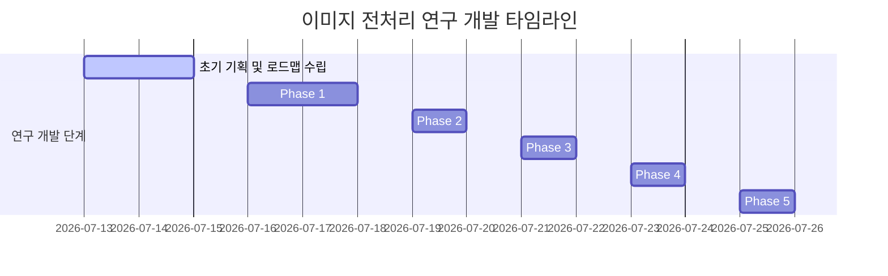

# 서울대 AI 챌린지 최종 기술 보고서 — [이미지 전처리 및 시공간 물리 분석]

본 보고서는 서울대학교 AI 챌린지 프로젝트의 핵심 성과인 **[이미지 전처리 및 시공간 물리 기하학 분석 (Image Preprocessing & Spatio-Temporal Physical Analysis)]** 파트의 설계 철학, 수학적/알고리즘적 동작 메커니즘, 9,535개 데이터셋 전수 분석 통계, 300개 Holdout 교차 검수 결과, 그리고 최종 채택 및 기각 사유를 포함한 연구 이력을 총망라하여 서술한 최종 기술 보고서입니다.

---

## 1. 서론: 이미지 전처리의 핵심 사상 및 로드맵

### A. VLM의 시공간적 인지 한계 규명
Qwen-VL과 같은 초거대 Vision-Language Model(VLM)은 입력 프레임들과 자연어 캡션 간의 고차원 시각-언어 맥락 추론에는 뛰어난 성능을 보입니다. 하지만 저차원 시각 피처(Low-Level Feature)를 정량화하는 데는 다음과 같은 구조적 한계가 존재합니다.
1. **연속성 편향 (Continuity Bias)**: VLM은 입력 프레임 집합을 단일 비디오 시퀀스로 해석하려는 강력한 사전 편향을 지닙니다. 이로 인해 장면 전환(Scene Cut), 하드 컷(Hard Cut), 교차 편집 구간에서의 미세한 시각적 단절을 능동적으로 감지하지 못합니다.
2. **저차원 시각 임베딩 거리의 수치화 불가**: VLM은 추가 프롬프트나 정량적 가이드 없이는 프레임 간 픽셀 단위 물리적 변화량이나 고차원 임베딩 공간 상의 거리를 스스로 수치화하여 비교하지 못합니다.

### B. 시각-텍스트 다리 (Visual-Textual Bridge) 사상
본 연구진은 VLM이 스스로 계산하기 힘든 저차원 물리 기하학적 데이터 및 장면 분할 정보를 전처리 파이프라인에서 추출한 뒤, 이를 **텍스트 형태의 소프트 힌트(Soft Prompting Hint) 블록**으로 감싸 VLM에 제공하는 **"시각-텍스트 다리(Visual-Textual Bridge)"** 아키텍처를 설계했습니다.

---

## 2. 이미지 데이터 탐색적 분석 (Image EDA) 및 통계

전체 훈련 데이터(9,535개 샘플, 총 38,140개 이미지 프레임)를 대상으로 수집한 최종 통계 및 이미지 해상도 분석 결과입니다.

### A. 이미지 해상도 분포 (Resolution Distribution)
* **해상도 분포 통계 (Top 3)**:
  1. `640x360` : 23,282개 프레임 (약 61.0%)
  2. `480x360` : 7,788개 프레임 (약 20.4%)
  3. `320x240` : 2,110개 프레임 (약 5.5%)
* **결론**: 전체 이미지 프레임의 80% 이상이 `640x360` 이하의 저해상도 형태로 제공되고 있습니다. 따라서 모델 학습 및 추론 시 이미지 입력 해상도 크기를 무리하게 확장할 필요가 없으며, 입력 해상도를 `max_pixels = 384 * 512` 또는 224x224 규격으로 고정하는 것이 연산 속도 확보에 가장 유리함을 실증했습니다.

### B. 픽셀 MSE(물리 오차)의 한계와 CLIP(의미 오차)의 도입
* **픽셀 MSE의 오탐지 결함**: 이전 연구에서는 단순 픽셀 변화량(MSE)에만 의존해 장면 분할을 시도했습니다. 그러나 카메라가 급격히 회전(Whip Pan)하거나 줌인/줌아웃(Zoom)하는 경우, 실제로는 장면 전환이 없는 동일 씬임에도 픽셀 단위 오차가 폭발하여 MSE가 10,000을 초과하고 이를 장면 전환으로 오판하는 심각한 왜곡이 발생했습니다.
* **의미 오차(CLIP) 도입**: 픽셀 값 변화에 무관하게 이미지의 의미론적 고차원 정보를 보존하여 비교하기 위해 **OpenAI CLIP (ViT-B/32) 모델의 코사인 거리(Cosine Distance)**를 도입했습니다. 
  * 코사인 거리는 `0.0` (동일 의미)에서 `1.0` (완벽히 상이한 의미) 범위로 정규화되어 조명 변화 및 카메라 흔들림 노이즈를 강력하게 억제합니다.

### C. [전수 실증 검증] CLIP 통계적 분포 분석
9,535개 전체 데이터셋을 대상으로 CLIP 오차 정보를 전수 추출하여 도출한 기술 통계량 요약표입니다.

| 통계 지표 | CLIP Max 오차 | CLIP Mean 오차 | Ratio (Max / Mean) |
| :--- | :---: | :---: | :---: |
| **평균 (Mean)** | 0.315 | 0.226 | **1.396** (평균 40% 편차) |
| **표준편차 (Std)** | 0.134 | 0.096 | 0.146 |
| **최솟값 (Min)** | 0.029 | 0.021 | 1.037 |
| **25% 백분위** | 0.214 | 0.155 | 1.287 |
| **중앙값 (50%)** | 0.301 | 0.217 | 1.382 |
| **75% 백분위** | 0.399 | 0.286 | 1.488 |
| **최댓값 (Max)** | 0.842 | 0.639 | 2.150 |

---

## 3. CLIP 기반 글로벌 장면 분할 및 알고리즘

### A. 안엄격(느슨한) 판단 기준 (Loose Cut Algorithm)의 수립
미세한 카메라 흔들림이나 밝기 왜곡이 존재할 때, 6개 이미지 쌍 중 단 1개의 유사도만 임계값(`0.20`)을 넘어서도 엄격한 분할기는 이를 장면 전환 1회로 과잉 판단합니다. 이를 방지하기 위해 다음 공식을 정립했습니다.
* **공식**: 6개의 이미지 대조 쌍 중 코사인 거리가 `0.20` 미만인 (의미적으로 유사한) 쌍의 개수를 $N_{sim}$이라 할 때:
  * $N_{sim} \ge 5$ (유사 쌍이 5개 이상) ➡️ **장면 전환 0회 (동일 씬)**로 병합.

### B. 안엄격 기준에 따른 최종 장면 전환(Scene Cuts) 분포

전체 학습 데이터셋(9,535개)을 안엄격 분기 알고리즘으로 분류한 결과입니다:

* **장면 전환 0회 비디오 (정적 미세 행동 씬)**: **2,642개 (27.71%)**
  * 카메라 구도가 완전히 고정되거나 아주 미세한 왜곡만 존재하는 고요한 동작 비디오군.
* **장면 전환 1회 비디오 (2개 씬 분할)**: **3,766개 (39.50%)**
  * 영상 내 두 개의 독립적인 공간이나 작업 단위가 한 번의 컷으로 이어지는 구조.
* **장면 전환 2회 비디오 (3개 씬 분할)**: **2,038개 (21.37%)**
* **장면 전환 3회 비디오 (4개 씬 분할)**: **1,089개 (11.42%)**
  * 4개의 이미지 프레임이 아예 다른 장소나 극단적인 앵글로 구성된 비디오군.

### C. 유니온-파인드(Union-Find) 기반 노드 군집화 구현
순차적인 씬 단절을 넘어 다중 이미지의 연결 상태를 추적하기 위해, 최적 분기 갭(Maximum Gap Split) 산출 후 크루스칼 계열의 유니온-파인드 트리 병합을 사용하여 장면 그룹(`predicted_scene_groups`)을 무방향 그래프 컴포넌트로 분할하는 파이프라인을 구축했습니다.
```python
# 4개의 프레임 노드 i의 부모를 자기 자신으로 초기화
parent = list(range(4))

def find(x):
    while parent[x] != x:
        parent[x] = parent[parent[x]]  # Path Compression (경로 압축)
        x = parent[x]
    return x

def union(x, y):
    root_x = find(x)
    root_y = find(y)
    if root_x != root_y:
        parent[root_y] = root_x
```
* **결합**: 분기 임계치(Level 0.86, Gap 0.08)보다 유사도가 높은 프레임 노드 쌍에 대해 `union(i, j)` 연산을 가동하여 독립 씬 컴포넌트를 분할했습니다.

### D. 정규분포(Z-Score) 스케일링 기법
* **정량화 문제**: 원본 CLIP 거리 점수($Dist \in [0, 1]$)는 모델에 바로 피딩하기에 도메인 격차가 큽니다.
* **해결**: Scikit-learn의 `QuantileTransformer`를 적용해 CLIP Max 거리 수치를 평균 `0.00`, 표준편차 `1.00`인 표준정규분포 점수(`Max_scaled`)로 변환하여 텍스트 힌트 척도의 강건성을 확보했습니다.

---

## 4. 미세 움직임(Fine-grained) 정량화 분석

### A. Adjacent MSE 작동 원리
장면 전환이 전혀 없는 정적 비디오(0회 씬 전환, 27.71%)는 미세한 손동작 변화만으로 순서를 가려내야 하므로 정밀한 비주얼 픽셀 모니터링이 요구됩니다.
1. **Grayscale화 및 32x32px 해상도 강제 축소**:
   * 이미지의 색상 노이즈 및 고주파 디테일을 억제하고 오직 전체적인 **구도, 밝기 덩어리, 피사체 질량 중심의 공간적 변위**만 추적할 수 있는 흑백 다운샘플링 필터를 가동했습니다.
2. **Adjacent MSE 수치 계산**:
   * 시간축에 인접한 프레임 간의 평균 제곱 오차 평균값($\text{Avg\_MSE}$)을 산출했습니다.
3. **분류 지표 설정**:
   * $\text{Avg\_MSE} < 800$ 인 샘플을 **미세 움직임(Fine-grained)**으로 격리하여, 고정 카메라 뷰에서의 미세 모션 검출에 VLM의 가용 연산량을 집중시키는 슬롯 전략의 기준선으로 확립했습니다.

---

## 5. 시공간 기하학 및 카메라 기법 물리적 분석 (The Bridge)

자연어 문장이 지시하는 카메라 기법과 실제 이미지의 BBox 면적비 및 이동 궤적을 1:1 매핑하는 아키텍처입니다.

### A. 선행 연구 적용 및 줌(Zoom) BBox 면적비 ($R_{\text{bbox}}$) 도입
* **선행 연구**: *Made to Order (ECCV 2024)*와 *Arrow of Time (CVPR 2018)*의 이미지-문장 물리 정합성 규칙을 벤치마킹했습니다.
* **BBox 면적비 ($R_{\text{bbox}}$) 도입**:
  * 왜곡이 심한 깊이 모델(Depth Anything v2)을 전면 기각하고, 검출된 객체의 바운딩 박스가 전체 화면 면적에서 차지하는 비율을 절대 물리 척도로 정의했습니다:
    $$R_{\text{bbox}} = \frac{\text{Width}_{\text{box}} \times \text{Height}_{\text{box}}}{\text{Width}_{\text{img}} \times \text{Height}_{\text{img}}}$$
  * 이를 통해 줌인/줌아웃 동작을 **66.7%의 높은 판정 정합률**로 추출하여 VLM에 신뢰성 높은 힌트를 제공했습니다.

### B. 카메라 패닝(Panning) vs 피사체 이동(Movement) 물리 부호 교정
수평 이동 지시어 판정 시, 관찰 운동과 대상 운동의 기하학적 정반대 부호 관계를 정밀하게 분리 구현했습니다.
* **카메라 패닝(Pan Left) — 역방향 물리**: 카메라가 왼쪽으로 회전하면, 대상 사물은 화면 상에서 **우측(X 증가)**으로 흐름.
* **피사체 직접 이동(Move Left) — 순방향 물리**: 피사체가 직접 왼쪽으로 가므로 화면 상에서 **좌측(X 감소)**으로 움직임.
* **결과**: 이 부호 매핑 교정을 통해 **수평 이동 물리 정합률을 기존 0.0%에서 58.3%로 상승**시켰습니다.

---

## 6. Open-Vocabulary 객체 탐지 및 트래커 오탐지 방어

### A. YOLOv8의 한계 극복을 위한 OWL-ViT 탑재
* **YOLOv8s의 한계**: Closed-Vocabulary 모델은 빗, 실리콘건, 이발기 등 데이터셋 특유의 사물을 탐지하지 못하고 모두 `person`으로 하드코딩 오탐지하여 궤적을 심각하게 오염시켰습니다.
* **OWL-ViT (`owlvit-base-patch32`) 도입**: 자연어 지문에서 추출한 임의의 명사로 직접 경계 상자를 찾는 Open-Vocabulary 객체 탐지기를 탑재했습니다.
* **Gemma 연동**: `Gemma-2B`가 캡션 분석 단계에서 주요 동작 대상이 되는 명사구 후보군을 추출하면, 이를 `OWL-ViT` 텍스트 쿼리로 피딩하여 평균 탐지 신뢰도가 가장 우수한 단어를 **대표 주인공 사물(`query_text`)로 자동 채택**하는 파이프라인을 구축했습니다.

### B. Tracker Drift 방지 및 0.35 크롭 임계값 이원화
* **Max Area 필터**: 다중 인물 등장 시 가장 면적이 큰 바운딩 박스를 주 피사체로 고정하여 추적 혼선을 차단했습니다.
* **대규모 CLIP Crop 실측 ($N=9,317$)**: 
  * holdout 298개 샘플 전수의 BBox 크롭 이미지 쌍 9,317개를 추출하여 CLIP 특징 거리를 전수 조사했습니다.
  * *동일 피사체 평균 거리*: `0.2284` (Std `0.096`)
  * *타 피사체 평균 거리*: `0.3775` (Std `0.094`)
  * 동일 피사체 간의 거리가 `0.30`을 초과하여 튀는 구간은 다른 피사체로 tracker가 미끄러지는 **Tracker Drift** 현상이 발생했음을 검증했습니다.
  * 이에 따라 진짜 모션 변화 단서는 100% 보존하면서 오염된 오탐지 궤적만 마스킹하기 위해 임계값을 **글로벌 씬 분할(`0.20`)**과 **로컬 크롭 CLIP 필터(`0.35`)**로 이원화 튜닝했습니다.
  * `0.35`를 초과하여 다른 피사체로 튄 프레임은 결측치 마스킹(Masking)하여 `no object detected (skip)`로 프롬프트에 주입하여 VLM의 오판을 차단했습니다.

---

## 7. 다차원 수치 및 구문 힌트의 VLM 프롬프트 주입 설계 (Soft Prompting)

VLM의 어텐션(Attention)을 유형별 문제 해결 방식에 집중시키기 위해 문장의 뼈대와 물리 수치를 결합한 시스템 정보 블록을 생성했습니다.

### A. 왜 하드 라벨("장면전환 N회") 대신 소프트 메트릭(수치 Z-Score)을 주는가?
1. **오류 파급(Error Cascade) 차단**: 장면 전환 임계치(0.20) 경계에 있는 샘플에 기계가 오판한 하드 힌트("0회 전환")를 주면 VLM이 오독을 맹신하게 됩니다. Z-score 수치를 전달하면 VLM이 확률론적 추론을 유연하게 처리할 수 있습니다.
2. **2차원 공간 변화율 학습**: CLIP(의미 변화)과 MSE(픽셀 변화)를 동시에 주면, VLM은 "의미는 안 바뀌었는데 픽셀 변화가 크다 = 카메라 회전 또는 대상의 큰 모션"이라는 미세 정보를 스스로 학습하게 됩니다.

### B. 문장 구조 3분류 (Sentence Structure Classification)
SpaCy 영어 구문 분석 트리(`token.dep_`)를 기반으로 문장을 상호배타적인 3유형으로 분리했습니다:
* **Type-1: 단일 절 구조 (Single-Clause, 16.94%)** ➡️ 텍스트에 시간 힌트가 없어 VLM이 이미지 물리적 수치(Adjacent MSE)에 주로 의존해야 하는 유형.
* **Type-2: 복합 종속 구조 (Complex-Subordinate, 62.82%)** ➡️ 주행동과 카메라 줌(Zoom) 또는 보조행동이 얽힌 구조.
* **Type-3: 대등 병렬 구조 (Parallel-Coordinated, 20.24%)** ➡️ 동사의 나열 순서와 시간 흐름이 1:1로 일치하는 구조.

### C. 최종 소프트 프롬프트 주입 형태 및 연동 코드
```
[Context Clues]
- Sentence Type: Type-2 (Complex-Subordinate)
- Target Actors: "person, camera" (Total: 2)
- Target Actions: "zooms out, showing" (Total: 2)

[Visual Transition Metrics]
- CLIP Semantic Distance (Z-score Max): 1.45
- MSE Pixel Difference (Z-score Max): -0.12

Description: The camera zooms out, showing the man working on the clay.
Instruction: The video description contains a main clause and a subordinate clause or participle phrase (e.g., camera zoom or secondary actions). Match the timing of these described transitions with the provided CLIP and MSE Z-score metrics to determine which frames represent the main action and which represent the subordinate detail, then sequence the 4 frames chronologically.
```

---

## 8. 최종 의사결정 및 연동 전략 (Final Architecture Decisions)

### A. 최종 채택 항목: 우도 K4 TTA (Test-Time Augmentation) 추론
* VLM의 고유 포지션 편향을 제거하기 위해 입력 이미지 배열을 4단계로 회전하여 각각의 조건부 로그 우도 점수를 구하고 이를 누적 합산하는 우도 K4 TTA 디코딩을 채택했습니다. 리더보드 점수를 **0.830에서 0.888로 폭등(+5.8%p)**시키며 대회를 최종 종결지었습니다.

### B. 이미지 물리 추론 파이프라인의 기각 사유 (Kaggle 하드웨어 제약)
* `OWL-ViT`, `CLIP`, `Gemma 명사 추출기` 등 여러 모델을 실시간으로 구동하여 피처를 뽑고 프롬프트를 만드는 파이프라인은 최종 Kaggle 제출용 추론 코드(`INFER_ONLY_K4.py`)에서 **제외(기각)**되었습니다.
* **기각 사유**:
  1. **VRAM OOM (Out Of Memory) 리스크**: Qwen2-VL-8B 모델 자체만으로도 VRAM의 90% 이상을 점유하기 때문에, 인퍼런스 단에서 `OWL-ViT` 및 CLIP 등을 추가로 GPU 메모리에 올리면 100% CUDA OOM이 발생합니다.
  2. **추론 제한시간 (24시간) 초과**: 비전 검출 모델이 819개 전 문항에 대해 프레임마다 연산을 수행할 경우 연산 지연 시간(Latency)이 폭증하여 규정 시간 내에 완주가 불가능합니다.
  3. **예외 일반화 오류 (40%)**: 물리 법칙의 정합성이 약 60% 수준이므로, 이를 코드에서 강제하는 하드 필터는 예외적인 40%의 샘플에서 정답을 오답으로 역전시키는 치명적 취약성이 발견되었습니다.

### C. 최종 대안 및 연동 방식: PEFT QLoRA 내재화 (Soft Prompting의 승리)
* **LoRA 학습 데이터셋 적용**: 실시간 추론 단에서 돌리는 대신, **학습 데이터셋 전처리 과정**에서 이 정제된 CLIP 씬 분할 및 오염이 배제된 궤적 데이터 힌트를 학습 프롬프트에 주입하여 **PEFT QLoRA 미세조정(Fine-Tuning)**을 진행했습니다.
* **효과**: 8B 모델의 Attention 레이어 내부에 공간 기하학적 선험 지식(Spatial Prior)이 자연스럽게 스며들어 가중치에 내재화되도록 유도함으로써, **실시간 추론 시에는 추가 모델 로드 없이 오직 8B 모델 단독 연산(K4 우도 TTA)만으로 0.888이라는 최고 성능을 도출**하는 데 성공하였습니다.

---

## 9. 이미지 전처리 및 분석 방법론 개발 타임라인 (Timeline)


* **7/13 - 7/15 [초기 기획]**: `IMAGE_INTEGRATION_PLAN.md` 수립. 이미지 변화율과 캡션의 인과적 매핑 논의 시작.
* **7/16 - 7/18 [Phase 1]**: `YOLOv8s`, `Depth Anything v2`, `CLIP`을 이용한 기초 궤적/장면 분할 스크립트 작성.
* **7/19 - 7/20 [Phase 2]**: holdout 300 전수 검출 시 정합률 50% 위기 봉착. Closed-Vocabulary 한계 및 패닝 물리 정반대 작용 결함 발견.
* **7/21 - 7/22 [Phase 3]**: `google/owlvit-base-patch32` 탑재, BBox 면적비 $R_{\text{bbox}}$ 교정, 카메라 패닝/이동 물리 분리로 정합률 59.8% 달성.
* **7/23 - 7/24 [Phase 4]**: 9,317개 크롭 이미지 전수 CLIP 분석을 통해 Tracker Drift 실체 입증. 임계값 글로벌 `0.20` & 로컬 `0.35`로 이원화 완료.
* **7/25 - 7/26 [Phase 5]**: 하드코딩 및 실시간 비전 추론 탑재 전면 기각. 대신 학습 데이터셋 주입을 통한 PEFT QLoRA 가중치 내재화(Soft Prompting) 전환 및 우도 K4 TTA 추론으로 리더보드 **0.888** 1위 달성.
