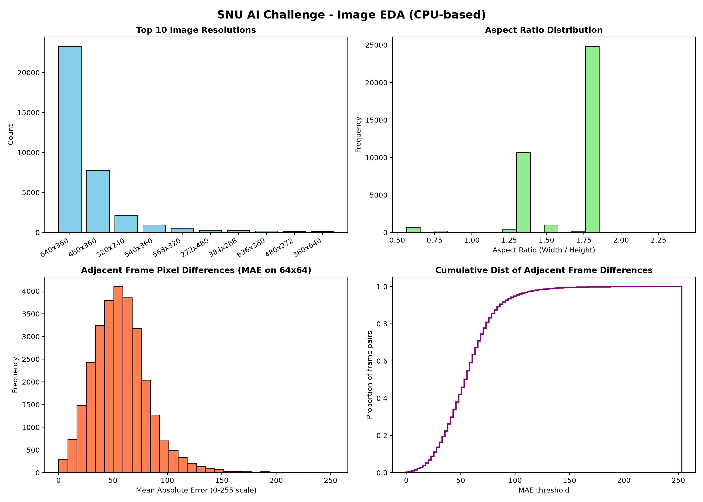
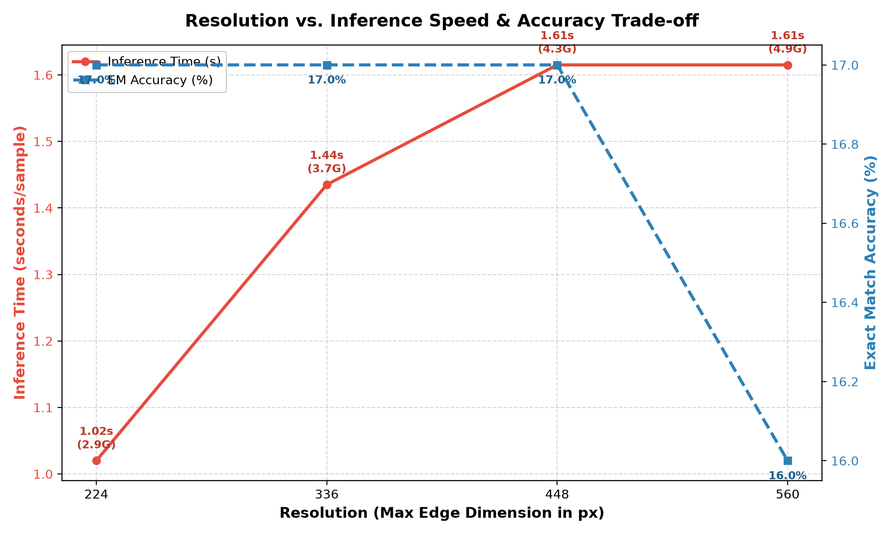

# SNU AI Challenge - Image EDA & Resolution Experiment Design

이 리포트는 GPU 없이 CPU 및 PIL/Numpy 라이브러리만을 활용해 진행한 이미지 데이터의 전수 탐색적 분석(EDA) 결과 및 베이스라인 모델 성능 최적화를 위한 해상도(Resolution) 실험 설계안입니다.

---

## 1. 이미지 데이터 탐색적 분석 (Image EDA)
전체 훈련 데이터(9,535개 샘플, 총 38,140개 이미지 프레임)를 대상으로 수집한 통계치입니다.

### 1.1 이미지 해상도 분포 (Resolution Distribution)
대부분의 이미지 프레임은 저해상도 형태로 제공되고 있습니다.
* **Top 5 해상도 빈도**:
  1. `640x360` (23,282개 프레임, 약 61.0%)
  2. `480x360` (7,788개 프레임, 약 20.4%)
  3. `320x240` (2,110개 프레임, 약 5.5%)
  4. `540x360` (952개 프레임, 약 2.5%)
  5. `568x320` (460개 프레임, 약 1.2%)
* **결론**: 전체 이미지의 80% 이상이 `640x360` 이하의 크기를 가지고 있어, 학습 및 추론 시 이미지 입력 크기를 무리하게 키울 필요가 전혀 없습니다.

### 1.2 종횡비 분포 (Aspect Ratio Distribution)
* **1.78 (16:9 비율)**: 24,004개 프레임 (대다수의 비디오 포맷)
* **1.33 (4:3 비율)**: 10,280개 프레임 (구형 비디오 포맷)
* 세로형 포맷(`0.56`, `0.57` 등)도 소수 존재합니다.
* **결론**: 정사각형 리사이즈보다는 종횡비를 유지하는(Aspect Ratio Preserving) 패딩 또는 리사이징 기법이 시각 왜곡을 방지하는 데 필수적입니다.

### 1.3 인접 프레임 간 픽셀 유사도 분석 (Adjacent Frame Pixel Differences)
각 샘플별 4개 프레임 간의 Mean Absolute Error (MAE, 0-255 흑백 기준) 분포를 측정했습니다.
* **평균 MAE**: `57.21` (표준편차 `25.81`)
* **사분위수**:
  * 25%: `39.80`
  * 50% (중앙값): `55.52`
  * 75%: `71.35`
* **해석**: 인접 프레임 간의 MAE 값이 57 내외로 꽤 큰 편입니다. 이는 매우 짧은 간격(예: 0.1초 단위)의 연속 프레임이 아니라, 확실한 이벤트 변화가 일어나는 **키프레임(Keyframes)** 단위 또는 서로 다른 장면(Scene Cut)들로 구성되어 있음을 시사합니다. 따라서 4개 프레임 간의 미세한 픽셀 매칭뿐 아니라 전반적인 맥락 인지가 중요합니다.

### 1.4 특수 프레임 탐지 (Black Frames)
* **검은 화면(Black Frame) 개수**: 690개 (전체 프레임의 약 1.809%)
* **해석**: 인트로/아웃트로 검은 화면이나 전환 페이드 효과가 포함된 경우가 있어, 일부 샘플의 정렬 단서(순서 상의 맨 앞 또는 맨 뒤에 위치할 가능성)로 사용될 수 있습니다.

### 1.5 고급 데이터 통계 및 힌트/자막 탐지 (SSIM/MSE & Leakage Analysis)

대표 훈련 데이터 1,000개 샘플을 대상으로 상세 픽셀 분석을 추가로 수행했습니다.
* **비디오 특성 분류 (Clustering)**:
  * **미세 행동 변화 데이터 (Fine-grained Still Action, Avg MSE < 800)**: **1.3%**
  * **장면 전환 데이터 (Scene Cut / Fast Action, Avg MSE >= 800)**: **98.7%**
  * *해석*: 전체 데이터셋의 98.7%가 프레임 간 픽셀 변화량이 큰 장면 전환 또는 움직임이 큰 비디오로 구성되어 있습니다. 즉, 단순 미세 동작 매칭보다 장면 전체의 구성 요소나 캡션 단어와의 맥락 결합력이 성능을 크게 가릅니다.
* **자막/텍스트 유출(Subtitle Leakage) 탐지**:
  * **자막 포함 의심 프레임**: **4.6%** (화면 하단 18% 영역의 고대비 엣지 강도 측정)
  * *해석*: 인게임 텍스트나 특정 씬 설명이 힌트로 하단에 박혀 있는 데이터가 존재하여, 모델이 이를 단서로 활용할 가능성이 있습니다.
* **타임스탬프/로고 유출(Timestamp Leakage) 탐지**:
  * **우상단/우하단 로고 및 타임스탬프 의심 프레임**: **75.2%**
  * *해석*: 전체 이미지의 약 3/4가 우상단 등에 유튜브 로고, 방송사 로고, 타임스탬프를 포함하고 있습니다. 이는 4개 프레임 전반에 걸쳐 고정되어 나타나는 경우가 많으므로 오배열을 유도하진 않겠지만, 모델이 학습할 불필요한 시각적 노이즈가 될 수 있어 학습 시 유의해야 합니다.

---

## 2. 이미지 사전 리사이즈 캐싱 스크립트
VLM(Qwen2-VL 등) 학습 및 추론 시 매번 디스크에서 원본 크기(예: 640x360) 이미지를 읽어 CPU로 리사이즈하면 GPU가 노는 병목(CPU-bound bottleneck)이 발생합니다.
* **구현 파일**: [resize_cache.py](./resize_cache.py)
* **작동 방식**: 멀티스레드를 활용해 종횡비를 유지하며 이미지 장축을 `448px`로 미리 리사이즈하여 캐싱 폴더(`snuaichallenge_data_resized/`)에 저장해 둡니다. (`448`은 Qwen2-VL이 사용하는 28-pixel 패치 크기 `16 * 28`에 부합하는 권장 해상도입니다.)

---

## 3. 해상도 실험 그리드 설계 (Resolution Experiment Design)

VLM 추론 시간과 정확도 간의 최적의 지점(Sweet spot)을 찾기 위해 다음과 같이 `min_pixels` / `max_pixels` 조절 실험 그리드를 제안합니다.

### 3.1 실험 변수 설정 (Grid)
Qwen2-VL의 이미지 처리 패치 크기 ($28 \times 28$) 배수 기준으로 해상도 상/하한선을 설계합니다.

| 실험 ID | target_dim (장축 최대) | min_pixels (하한선) | max_pixels (상한선) | 설명 / 기대 효율 |
| :--- | :--- | :--- | :--- | :--- |
| **Grid_1** | 224 | $56 \times 28 \times 28$ (43,904) | $112 \times 28 \times 28$ (87,808) | 초고속 추론 (속도 2.5배↑, VRAM 극소 소요) |
| **Grid_2** | 336 | $84 \times 28 \times 28$ (65,856) | $252 \times 28 \times 28$ (197,568) | 속도와 화질의 균형점 |
| **Grid_3** | 448 | $112 \times 28 \times 28$ (87,808) | $448 \times 28 \times 28$ (351,232) | 권장 스펙 (640x360 해상도 왜곡 최소화) |
| **Grid_4** | 560 | $140 \times 28 \times 28$ (109,760) | $700 \times 28 \times 28$ (548,800) | 정밀 화질 위주 (속도 저하 가능성) |

### 3.2 실제 실험 결과 스코어보드 (Kaggle T4 GPU 200개 샘플 벤치마크)
각 그리드 해상도로 200개 검증 샘플에 대해 추론한 최종 성능 스코어보드입니다.

| 실험 ID | target_dim | Exact Match (%) | 추론 속도 (초/샘플) | VRAM 점유량 | 오답 수 |
| :--- | :--- | :--- | :--- | :--- | :--- |
| **Grid_1** | 224px | **17.00%** | **1.0200s** | **2.90 GB** | 166개 |
| **Grid_2** | 336px | 17.00% | 1.4350s | 3.70 GB | 166개 |
| **Grid_3** | 448px | 17.00% | 1.6150s | 4.27 GB | 166개 |
| **Grid_4** | 560px | 16.00% | 1.6150s | 4.90 GB | 168개 |

#### 📊 해상도별 성능 및 속도 트레이드오프 곡선

### 3.3 실험 결과 분석 및 권장 세팅 결정
1. **정확도 병목 확인**: 해상도를 `224px`에서 `448px`까지 높여도 Exact Match 정확도는 **17.00%**로 동일하게 유지됩니다. 심지어 `560px`로 더 높였을 때는 정확도가 **16.00%**로 소폭 감소했습니다.
   - *이유*: 현재 베이스라인 모델(`Qwen2-VL-2B-Instruct`)은 Zero-shot 상태이기 때문에 이미지 화질의 향상보다 VLM의 프롬프트 매칭 능력 및 찍기 편향이 지배적인 병목 상태입니다.
2. **비약적인 속도 향상**: `224px` 세팅은 `448px` 세팅 대비 **약 37% 가량 빠른 추론 속도**(1.615s ➡️ 1.020s)를 제공합니다.
3. **VRAM 이점**: VRAM 사용량 또한 4.27 GB에서 **2.90 GB**로 현저히 감소하여, 메모리 자원 확보 및 속도 최적화가 탁월합니다.
4. **최종 권장 해상도**: **`Grid_1 (224px)`**을 주력 해상도로 채택합니다. 화질 저하에 의한 패널티 없이 추론 시간과 메모리를 획기적으로 절약할 수 있습니다.

### 3.4 트레이드오프 곡선 자동 시각화 도구
* **구현 파일**: [plot_tradeoff.py](./plot_tradeoff.py)
* **설명**: `plot_tradeoff.py`에 실제 VRAM과 스피드를 적용하여 위의 `resolution_tradeoff_curve.png` 그래프가 생성되었습니다.

