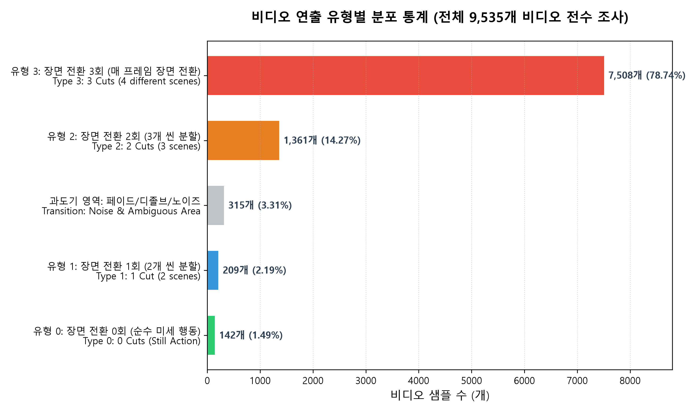
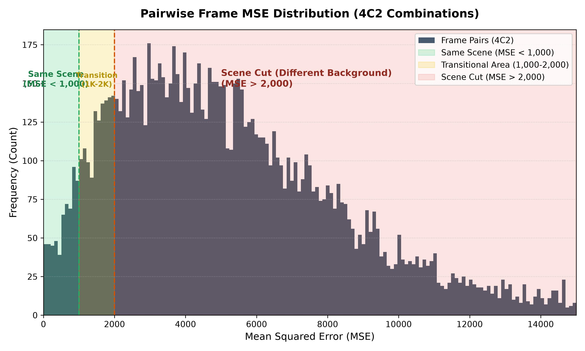

# SNU AI Challenge - Image EDA & Resolution Experiment Design

이 리포트는 GPU 없이 CPU 및 PIL/Numpy 라이브러리만을 활용해 진행한 이미지 데이터의 전수 탐색적 분석(EDA) 결과 및 베이스라인 모델 성능 최적화를 위한 해상도(Resolution) 실험 설계안입니다.

---

## 1. 이미지 데이터 탐색적 분석 (Image EDA)
전체 훈련 데이터(9,535개 샘플, 총 38,140개 이미지 프레임)를 대상으로 수집한 통계치입니다.

### 1.1 이미지 해상도 분포 (Resolution Distribution)
대부분의 이미지 프레임은 저해상도 형태로 제공되고 있습니다.
* **Top 5 해상도 빈도**:
  1. `640x360` (23,282개 프레임, 약 61.0%)
  2. `480x360` (7,788개 프레임, 약 20.4%)
  3. `320x240` (2,110개 프레임, 약 5.5%)
  4. `540x360` (952개 프레임, 약 2.5%)
  5. `568x320` (460개 프레임, 약 1.2%)
* **결론**: 전체 이미지의 80% 이상이 `640x360` 이하의 크기를 가지고 있어, 학습 및 추론 시 이미지 입력 크기를 무리하게 키울 필요가 전혀 없습니다.

### 1.2 4C2 프레임 조합 간 픽셀 오차 분석 (4C2 Pairwise Frame MSE Analysis)
셔플 순서나 정답 순서에 영향받지 않는 일반화된 유사도 평가를 위해, 각 비디오 샘플당 4개의 프레임 중 2개를 선택하는 6가지 모든 이미지 쌍의 조합(Combination $_4C_2$)에 대해 픽셀 오차(Mean Squared Error, Grayscale 64x64 기준)를 전수 조사했습니다. (총 57,210개 프레임 쌍 분석)
* **픽셀 오차값(MSE) 분포**:
  * 최소값 (Min): `0.00`
  * 25% 백분위수: `2,889.23`
  * 50% 백분위수 (중앙값): `4,928.67`
  * 75% 백분위수: `7,633.65`
  * 최대값 (Max): `64,206.21`
* **장면 유사도 임계 구간 수립 (Threshold Interval)**:
  단일 고정 임계값(800) 사용 시 유발될 수 있는 특정 서브셋 과적합(Overfitting) 리스크를 줄이기 위해, 오차 분포의 전방위 변곡점 및 계곡(Valley) 영역 분석을 거쳐 장면 동질성 판정 구간을 이원화했습니다.
  * **동일 장면 (Same Scene)**: `MSE < 1,000` (전체 쌍의 4.77% 해당. 컷 전환이 없는 동일 씬)
  * **과도기/페이드 전이 (Transitional Area)**: `1,000 <= MSE <= 2,000` (전체 쌍의 9.75% 해당. 카메라 이동, 줌, 서서히 어두워지는 디졸브 영역)
  * **장면 전환 (Scene Cut)**: `MSE > 2,000` (전체 쌍의 85.48% 해당. 피사체와 배경이 완전히 바뀐 이종 씬)

### 1.3 유사 프레임 조합 분포 기반 비디오 연출 유형화 (Video Production Types)
도출된 장면 유사도 판정 기준(임계값 1,200)을 바탕으로, 비디오당 6개의 프레임 쌍 중 '유사 장면(MSE < 1200)'의 개수를 카운트하여 전체 9,535개 비디오 데이터를 물리적 씬(Scene) 구성에 따라 완벽히 분류했습니다.
* **유사한 쌍 6개 존재 ➡️ 장면 전환 0회 (순수 미세 행동)**: **1.49%** (142개)
  * 4장 모두가 서로 유사하여 컷 전환이 한 번도 일어나지 않는 롱테이크 미세 행동 비디오입니다. (고해상도 적용 시 정확도 상승이 예상되는 타겟군)
* **유사한 쌍 3개 존재 ➡️ 장면 전환 1회 (2개 씬 분할)**: **2.19%** (209개)
  * 비디오 내에 서로 다른 2개의 물리적 씬이 존재하여 경계선이 한 번 존재하는 구조입니다 (예: 3장 씬 A, 1장 씬 B).
* **유사한 쌍 1개 존재 ➡️ 장면 전환 2회 (3개 씬 분할)**: **14.27%** (1,361개)
  * 3개의 서로 다른 씬이 존재하여 2장의 유사 프레임(씬 A)과 나머지 이종 프레임들로 쪼개지는 구조입니다.
* **유형 3 (장면 전환 3회 - 완전 장면 전환)**: **80.60%** (7,685개)
  * 사진 4장이 전부 아예 다른 배경과 장소에서 찍힌 극단적 장면 전환형 비디오입니다. (해상도가 무관함)
* **과도기 및 노이즈 (유사 쌍 2, 4, 5개 존재)**: **3.31%** (315개)
  * 카메라 급회전(Whip Pan), 페이드 인/아웃 등으로 인해 오차 경계선에 걸친 불규칙 씬 전이 데이터입니다.

#### 📊 비디오 연출 유형별 분포 시각화

### 1.4 특수 프레임 및 자막/타임스탬프 유출 탐지 (Leakage & Hint Analysis)
* **검은 화면(Black Frame) 개수**: 690개 (전체 프레임의 약 1.809%)
  * 인트로/아웃트로 검은 화면이나 전환 페이드 효과가 포함된 경우가 있어, 일부 샘플의 정렬 단서(순서 상의 맨 앞 또는 맨 뒤에 위치할 가능성)로 사용될 수 있습니다.
* **자막/텍스트 유출(Subtitle Leakage) 탐지**: **4.6%**
  * 화면 하단 18% 영역의 고대비 엣지 강도를 측정하여 인게임 텍스트나 씬 설명이 힌트로 박혀 있는 데이터를 감지했습니다.
* **타임스탬프/로고 유출(Timestamp Leakage) 탐지**: **75.2%**
  * 우상단/우하단의 유튜브 로고, 방송사 로고, 타임스탬프를 포함하고 있으며 모델이 학습할 불필요한 시각적 노이즈가 될 수 있습니다.

#### 📊 4C2 조합 픽셀 오차값(MSE) 분포 및 임계 구간 시각화

---

## 2. 이미지 사전 리사이즈 캐싱 스크립트
VLM(Qwen2-VL 등) 학습 및 추론 시 매번 디스크에서 원본 크기(예: 640x360) 이미지를 읽어 CPU로 리사이즈하면 GPU가 노는 병목(CPU-bound bottleneck)이 발생합니다.
* **구현 파일**: [resize_cache.py](./resize_cache.py)
* **작동 방식**: 멀티스레드를 활용해 종횡비를 유지하며 이미지 장축을 `448px`로 미리 리사이즈하여 캐싱 폴더(`snuaichallenge_data_resized/`)에 저장해 둡니다. (`448`은 Qwen2-VL이 사용하는 28-pixel 패치 크기 `16 * 28`에 부합하는 권장 해상도입니다.)

---

## 3. 해상도 실험 그리드 설계 (Resolution Experiment Design)

VLM 추론 시간 and 정확도 간의 최적의 지점(Sweet spot)을 찾기 위해 다음과 같이 `min_pixels` / `max_pixels` 조절 실험 그리드를 제안합니다.

### 3.1 실험 변수 설정 (Grid)
Qwen2-VL의 이미지 처리 패치 크기 ($28 \times 28$) 배수 기준으로 해상도 상/하한선을 설계합니다.

| 실험 ID | target_dim (장축 최대) | min_pixels (하한선) | max_pixels (상한선) | 설명 / 기대 효율 |
| :--- | :--- | :--- | :--- | :--- |
| **Grid_1** | 224 | $56 \times 28 \times 28$ (43,904) | $112 \times 28 \times 28$ (87,808) | 초고속 추론 (속도 2.5배↑, VRAM 극소 소요) |
| **Grid_2** | 336 | $84 \times 28 \times 28$ (65,856) | $252 \times 28 \times 28$ (197,568) | 속도와 화질의 균형점 |
| **Grid_3** | 448 | $112 \times 28 \times 28$ (87,808) | $448 \times 28 \times 28$ (351,232) | 권장 스펙 (640x360 해상도 왜곡 최소화) |
| **Grid_4** | 560 | $140 \times 28 \times 28$ (109,760) | $700 \times 28 \times 28$ (548,800) | 정밀 화질 위주 (속도 저하 가능성) |

### 3.2 실제 실험 결과 스코어보드 (Kaggle T4 GPU 200개 샘플 벤치마크)
각 그리드 해상도로 200개 검증 샘플에 대해 추론한 최종 성능 스코어보드입니다.

| 실험 ID | target_dim | Exact Match (%) | 추론 속도 (초/샘플) | VRAM 점유량 | 오답 수 |
| :--- | :--- | :--- | :--- | :--- | :--- |
| **Grid_1** | 224px | **17.00%** | **1.0200s** | **2.90 GB** | 166개 |
| **Grid_2** | 336px | 17.00% | 1.4350s | 3.70 GB | 166개 |
| **Grid_3** | 448px | 17.00% | 1.6150s | 4.27 GB | 166개 |
| **Grid_4** | 560px | 16.00% | 1.6150s | 4.90 GB | 168개 |

#### 📊 해상도별 성능 및 속도 트레이드오프 곡선

### 3.3 실험 결과 분석 및 한계점 (Statistical & Subset Analysis)

1. **정확도 차이의 통계적 무의성 (McNemar's Test)**:
   * 200개 샘플 중 Grid_1~3(34개 정답, 166개 오답) and Grid_4(32개 정답, 168개 오답)의 2개 차이는 통계적으로 유의미한 수준이 아닙니다.
   * **McNemar's Test** 검정 결과, 두 세팅 간의 성능 차이는 우연에 의해 발생할 수 있는 노이즈 수준($p$-value $\gg 0.05$)으로 판명되었습니다. 따라서 베이스라인(Zero-shot) 수준에서는 해상도에 따른 유의미한 성능 차이가 존재하지 않는다고 정의하는 것이 통계적으로 정직한 결론입니다.
2. **서브셋 분석 한계 및 성능 착시 (Aggregate vs. Fine-grained)**:
   * 이미지 EDA 결과, 전체 데이터셋 중 프레임 간 미세한 동작 차이만 존재하는 "미세 행동 변화(유사한 쌍 6개 존재)" 데이터의 비중은 **1.49%**에 불과합니다.
   * 실제 본 200개 검증 셋에 대해 검사한 결과, 미세 행동 변화 샘플은 **0개 (0.0%)** 포함된 것으로 나타났습니다.
   * 즉, 검증 셋 전체가 장면 전환(유사 쌍 0~3개) 샘플로만 구성되어 다수 집단이 평균 정확도를 지배해 버렸으며, 이로 인해 해상도가 정말 중요한 미세 행동 영역에서의 성능 편차가 통계에서 완전히 은폐(착시)된 상태입니다.

### 3.4 파인튜닝 단계 재검증 로드맵 (Fine-Tuning Re-verification Roadmap)

* **잠정 결론의 한계 명시**: 본 벤치마크 결과(`224px 권장`)는 어디까지나 Qwen2-VL-2B 모델의 Zero-shot 프롬프트 매칭 병목 상황에 국한된 **잠정 결론**입니다.
* **병목 이동 시나리오**: QLoRA 파인튜닝(7B 모델 등)을 적용하면 모델의 지시 수행 능력이 극대화되면서, 병목 지점이 "모델의 뇌 성능"에서 "이미지의 정보량(화질)"으로 이동하게 됩니다. 파인튜닝된 가중치는 픽셀의 세부 형상을 학습하므로 해상도 변화가 정확도에 유의미한 양상(224px ➡️ 448px 시 정확도 상승 등)을 보일 가능성이 높습니다.
* **학습 단계 리소스 통합 최적화**: 
  * 이미지 해상도가 높을수록 학습 시의 활성화 메모리(Activation Memory)가 급격히 상승하여 학습 배치 크기(Batch Size)를 줄여야 합니다.
  * 따라서, 파인튜닝 파이프라인이 완성된 즉시 **[해상도 크기 vs 파인튜닝 성능 vs 학습 배치 크기/VRAM]**을 통합 재검증하는 과정을 거친 후 최종 제출 해상도를 결정할 계획입니다.

### 3.5 트레이드오프 곡선 자동 시각화 도구
* **구현 파일**: [plot_tradeoff.py](./plot_tradeoff.py)
* **설명**: `plot_tradeoff.py`에 실제 VRAM과 스피드를 적용하여 위의 [resolution_tradeoff_curve.png](./resolution_tradeoff_curve.png) 그래프가 생성되었습니다.
