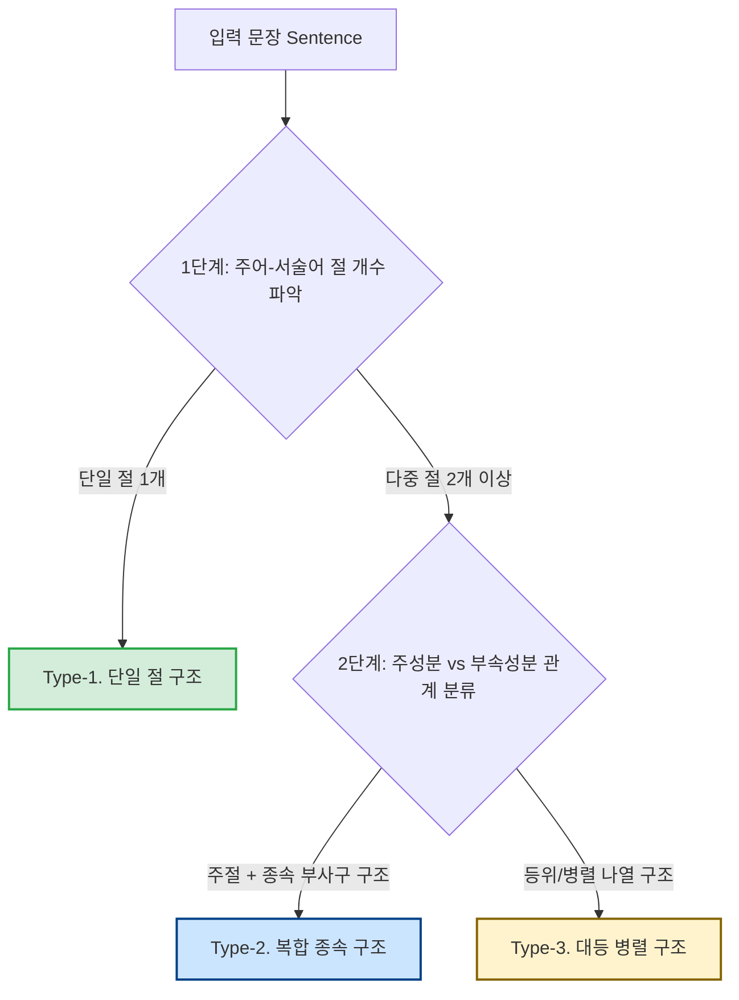

# 문장 모호성 탐색적 분석 및 3유형 × 직교 플래그 고도화 보고서
(Sentence Ambiguity EDA: 3-Stage Partition & Orthogonal Flag Taxonomy)

본 보고서는 SNU AI Challenge 비디오 프레임 순서 예측 경진대회에서 제공되는 텍스트(Sentence) 데이터의 시간적 모호성을 분석하고, 이를 객관적으로 정량화하여 VLM(Vision-Language Model) 학습 및 추론 파이프라인에 결합하기 위한 종합 전략 설계안입니다. 

기존의 5단계 분류 체계가 가진 데이터 희소성 및 과적합 문제를 해결하기 위해, 문맥의 통사 구조(절 개수)를 기준으로 한 **상호배타적 3단계 1차 파티션**과 담화/의미론적 특성을 독립적으로 추출하는 **직교 플래그(Orthogonal Flags)**를 결합하는 고도화 아키텍처를 정의하고 실측 검증 결과를 정리했습니다.

---

## 🚀 [노션 공유용 요약] 문장 모호성 분류 체계 한눈에 보기

> 💡 **한 줄 요약**:
> 문장의 문법적 구조를 뜻하는 **'3단계 통사 파티션'**과 시간 단서들의 의미론적 분류인 **'7대 직교 플래그'**를 나침반 삼아 문맥의 시간 모호성 점수(AI Score)를 계산해 내는 종합 분류 체계입니다.

---

### 📌 1. 3단계 통사 파티션 (상호배타적 분류)
* [ ] **Type-1. 단일 절 구조 (Single-Clause) [비중: 16.94%]**
  * 주어-서술어가 단 1쌍만 존재 (예: *"A boy kicks the ball."*) ➔ 텍스트 내 시간 단서가 없어 이미지 상태 변화와 연속성만으로 정렬해야 함 (**Visual-First 추론**)
* [ ] **Type-2. 복합 종속 구조 (Complex-Subordinate) [비중: 62.82%]**
  * 주절 + 종속절/분사구문 구조 (예: *"The camera zooms out, showing a tattoo..."*) ➔ 부사절 접속사에 의존 (**Text-First & Hybrid**)
* [ ] **Type-3. 대등 병렬 구조 (Parallel-Coordinated) [비중: 20.24%]**
  * 콤마 또는 `and`로 대등 연결 (예: *"The chef chops onions and mixes them..."*) ➔ 어순 나열을 시간 흐름으로 1:1 대응 (**Sequence-Prior**)

---

### 📌 2. 7대 직교 플래그 (의미론적 다중 라벨)
* **N1. 카메라/편집 담화 (`N1_camera`) [빈도: 45.24%]**: `camera`, `scene shifts`, `pan` 등 지시 ➔ 시각적 씬 편집 지점(Scene Cut) 검출에 활용
* **N2. 상적 국면 전이 (`N2_phase`) [빈도: 10.19%]**: `start`, `begin`, `continue`, `stop` 등 ➔ 사건의 개시/지속/종결 시각 매핑
* **N3. 절차 지식 의존 (`N3_script`) [빈도: 4.24%]**: 요리/조립 등 인과 상식 ➔ 상식 그래프 의존도 측정
* **N4. 지시 표현 진행 (`N4_referential`) [빈도: 5.34%]**: `a gymnast` ➔ `she` 등 대명사 전환 ➔ 개체 연속성 추적
* **N5. 외형/상태 변화 (`N5_state_change`) [빈도: 4.27%]**: `transitions from A to B` 등 ➔ 저수준 색상 및 피사체 외형 전이 분석
* **N6. 반복/순환 동작 (`N6_iterative`) [빈도: 1.34%]**: `again`, `repeatedly` 등 ➔ 순서 교환 가능 영역 (**역단서, 모델 강제성 완화**)
* **N7. 서수 열거 (`N7_ordinal`) [빈도: 1.66%]**: `first`, `second`, `finally` ➔ 1:1 순서 인덱스로 활용

---

### 📌 3. 최종 모호성 스코어 (AI Score) 계산식

$$\text{AI Score} = \text{Base Score} + \sum \Delta \text{Flag Scores}$$

* **기본 점수 (Base)**: Type-1 (`0.80`) / Type-2 (`0.40`) / Type-3 (`0.50`)
* **플래그 보정값 ($\Delta$ Flag)**: `N6` (+0.30) / `N5` (-0.30) / `N1` (-0.20) / `N7` (-0.20) / `N2` (-0.10)
* ➔ **점수 의미**: `0.0` (명확) ~ `1.1` (극도 모호, 시각 추론 100% 의존)

---


## 1. 개요 및 3유형 파티션 설계 원칙

비디오 프레임의 시간적 선후 관계를 유추하기 위해 문장에서 획득할 수 있는 정보는 1차적으로 문장의 문법적 뼈대(통사 구조)에 지배받습니다. 

본 설계는 어순 변화나 도치문에서도 극도의 강건성을 유지하기 위해 **"주어-서술어 절의 개수 및 결합 관계"**를 기준으로 문장을 다음 3가지 상호배타적(Mutually Exclusive) 유형으로 1차 분할합니다.



* **Type-1. 단일 절 구조 (Single-Clause)**: 주체-서술어(동사) 쌍이 문장 전체에 단 1개만 존재하는 구조. 텍스트 자체에는 선후 관계가 없으며 VLM의 시각 추론에 전적으로 의존해야 함.
* **Type-2. 복합 종속 구조 (Complex-Subordinate)**: 메인 주절이 존재하고, 이를 시간적 배경이나 선후 관계로 묶어주는 종속 부사절/분사구가 결합된 구조.
* **Type-3. 대등 병렬 구조 (Parallel-Coordinated)**: 다수의 사건이 콤마(`,`)나 대등 접속사(`and`)로 계층 없이 나열된 구조.

---

## 2. 1차 파티션 실측 통계 분포

전체 학습 데이터셋(`train.csv`, 9,535개) 및 평가 데이터셋(`test.csv`, 819개)에 대하여 경량 규칙 사전 기반의 절 파서를 적용해 도출한 실측 분포입니다.

| 1차 파티션 유형 | Train 개수 (비율) | Test 개수 (비율) | 주요 텍스트/비주얼 추론 가이드 |
| :--- | :---: | :---: | :--- |
| **Type-1. 단일 절 구조** | 1,615 (16.94%) | 74 (9.04%) | **Visual-First:** 텍스트 내 선후 힌트 부재. 이미지 피사체 상태 변화 및 Temporal Continuity 추론. |
| **Type-2. 복합 종속 구조** | 5,990 (62.82%) | 656 (80.10%) | **Text-First & Hybrid:** 종속 접속사 종류에 따라 시계열 정렬 또는 동시성 배경 분리 처리. |
| **Type-3. 대등 병렬 구조** | 1,930 (20.24%) | 89 (10.87%) | **Sequence Mapping:** 문장의 나열 순서(좌->우)와 이미지 씬 전이를 1:1로 매핑하는 가이드 유도. |

> [!NOTE]
> 기존 5단계 분류에서는 가장 희소한 카테고리(Static-State)의 샘플 수가 19개(0.2%)에 불과하여 통계적 일반화 및 모델링 학습이 불가능했습니다. SpaCy 구문 트리를 적용한 3단계 개편 결과, 가장 샘플이 적은 유형인 Type-1(단일 절)도 **Train 기준 1,615개(16.94%)**, Type-3(병렬)도 **1,930개(20.24%)**로 고르게 확보되어 학습 불균형 리스크가 완전히 소멸되었습니다.

---

## 3. 다차원 고도화: "1차 파티션 + 직교 플래그 (Multi-label)" 아키텍처

### 3.1 왜 신규 유형을 4번째, 5번째 파티션으로 확장하면 안 되는가?
현행 3유형은 **통사적 뼈대(구조)**라는 단일 차원의 분할(Partition)입니다. 반면 선행연구에서 탐색되는 다양한 시간 단서(예: 카메라 움직임, 동작 반복 등)는 **의미론 및 담화 차원**의 개념으로 3유형과 직교(Orthogonal)합니다.
이를 단일 파티션에 구겨 넣게 되면:
1. **유형 충돌**: "The camera pans left, then shifts..." 라는 문장은 '다중 절-종속(Type-2)' 구조이면서 동시에 '카메라 담화'에 속하여 우선순위 예외 규칙이 끊임없이 늘어납니다.
2. **희소성 문제의 재현**: 카테고리가 쪼개질수록 개별 클래스의 샘플 수가 붕괴되어 모델이 과적합(Overfitting)을 일으킵니다.

### 3.2 직교 플래그 벡터 설계
따라서 본 체계는 3유형 파티션을 깨지 않는 상태에서, 의미론적 특징들을 **독립적 이진 플래그(Binary Flags)**로 병렬 추출하여 다중 라벨(Multi-label) 벡터로 구조화합니다.

$$\text{Sentence Vector} = [\text{Partition: Type 1-3 (One-hot)}] \oplus [\text{Flags: } N_1, N_2, \dots, N_k \text{ (Binary Vector)}]$$

### 3.3 집계 추론 모드 (Aggregated Routing Modes) 설계
7개의 이진 플래그 조합($2^7 = 128$가지)을 개별 프롬프트나 학습 분기로 설계하는 것은 오버헤드가 크고 통계적으로 비효율적입니다. 따라서 실전 추론 시에는 이 플래그들을 결합하여 최종적으로 **4가지 '집계 추론 모드'**로 묶어 라우팅합니다.

| 집계 추론 모드 (Aggregated Mode) | 활성화 플래그 조건 | VLM 프롬프팅 및 모델링 전략 |
| :--- | :--- | :--- |
| **Discourse-Cut (씬 전환 모드)** | `N1_camera == 1` 또는 `N7_ordinal == 1` | 씬 전환 경계(Cut frame) 및 서수 지시 위치를 텍스트 앵커와 우선 매핑 (**Text-First**) |
| **State-Change (외형 변화 모드)** | `N5_state_change == 1` | 대상 객체의 복장/색상/외형 정보 변화에 어텐션을 고정하도록 프롬프트 유도 (**Visual-First, Target Focus**) |
| **Sequence-Anchor (순서 지지 모드)** | `Type-3 (Parallel)` & `N4_referential == 1` | 텍스트 나열 순서가 곧 시간적 흐름(좌->우)임을 강제 신뢰하도록 프롬프트 가중치 설정 (**Sequence-Prior**) |
| **Iterative-Ignore (반복 예외 모드)** | `N6_iterative == 1` | 동작이 순환되므로 순서 예측이 물리적으로 무의미함을 인지. 예측 강제를 완화하고 `No_ordering` 가능성 대비 (**Iterative-Prior**) |

---

## 4. 선행연구 기반 신규 유형(플래그) 카탈로그 및 실측 결과

학습 데이터셋(9,537개 문장) 전체를 대상으로 각 후보 유형의 대표 어휘를 추출하는 **어휘 프로브(Lexical Probe)** 실측 검증 결과 및 선행연구 근거입니다.

### N1. 카메라/편집 담화 (Cinematographic Discourse) — [실측 빈도: Train 45.24% / Test 42.12%] ★최우선
* **정의**: 스토리 속 주체의 동작이 아닌, **영상의 촬영, 앵글 조절, 컷 편집 행위 자체**를 서술하는 절이 포함된 문장.
  - *ⓐ 카메라 주어*: "The camera pans left" (5.1%)
  - *ⓑ 장면 전환*: "the scene shifts/cuts to" (4.2%)
  - *ⓒ 제시형 수동태*: "is shown/is seen" (3.3%)
* **선행연구 근거**: Visual Storytelling(VIST) 및 Sort Story(Agrawal et al., EMNLP 2016) 연구에 기반한 "Literal Description vs. Narrative"의 담화 층위 구분. 기존의 구문 파서는 "The camera pans"를 일반 절로 처리하므로 이 층위를 감지하지 못함.
* **프로브 정규식**: `camera|scene|zoom|pan|shot|close-up|cuts\s+to|transition|fade|screen|view\s+shift`
* **데이터 실례**: *"The camera pans left to reveal two people..., then shifts from a frontal to a rear view..."*
* **순서 단서 성격**: **강력한 시각적 앵커(+)**. 특히 "scene shifts" 절은 프레임 오차(pairwise MSE)가 급증하는 물리적 씬 경계(Scene Cut)와 1:1 매칭될 확률이 극도로 높음.
* **전략 가설**: VLM 추론 시, "scene shifts"의 위치를 기준으로 이미지를 군집화하여 절-프레임 매핑 복잡도를 줄임.

### N2. 상적 국면 전이 (Aspectual Phase Transition) — [실측 빈도: Train 10.19% / Test 7.45%] ★차순위
* **정의**: 사건의 시작, 지속, 종결의 **시간적 국면(Aspectual Phase)**을 서술하는 상 동사(Phase Verb)가 다른 동작을 제어하는 구조.
* **선행연구 근거**: TimeML 표준의 **ALINK(Aspectual Link)** 관계식인 INITIATES(begins/starts), CULMINATES(finishes), TERMINATES(stops), CONTINUES(keeps) 정의를 반영.
* **프로브 정규식**: `\b(begin|start|continue|finish|stop|resume|end\s+up|proceeds\s+to)\b`
* **데이터 실례**: *"The skater begins to glide down the road, then falls and lies..."*
* **순서 단서 성격**: **순단서(+)**. 단일 씬(유사쌍 3개 이상) 비디오에서 동작의 순서를 가리는 데 결정적임. "begins X"는 개시 자세 프레임(앞), "finishes X"는 완료 포즈 프레임(뒤)을 지칭.
* **전략 가설**: PHASE 플래그가 켜진 고모호성 샘플의 경우, 동작의 시작점(initiation)과 종결점(termination) 자세를 정밀 대조하라는 VPP 힌트 주입.

### N3. 스크립트/절차 지식 의존 (Script-Knowledge Dependent) — [실측 빈도: Train 4.24% / Test 4.64%]
* **정의**: 문장 내에 시간 접속사가 0개이지만, **보편적인 절차 및 인과 상식(Script)**에 의해 선후 순서가 유일하게 고정된 문장.
* **선행연구 근거**: Chambers & Jurafsky (ACL 2008)의 *Narrative Event Chains* (동일 주체의 비지도 사건 사슬 학습) 및 *proScript* (부분 순서 스크립트 생성 그래프).
* **프로브 정규식**: (요리 도메인 예시) `\b(bake|mix|pour|chop|fry|serve|stir|knead|slice)\b` 및 시간 부사가 없는 다중 절 구조.
* **데이터 실례**: *"Dough is scraped into a bowl, shaped into balls, and placed on a baking tray."* (시간 지시어는 없으나 반죽->성형->오븐 배치의 물리적 인과 상식이 요구됨)
* **순서 단서 성격**: **암묵적 순단서(+)**. 모델 내부의 사전 학습된 상식에 완전히 의존함.
* **전략 가설**: 이 플래그는 프롬프트 힌트 주입용보다는 **오류 분석(Error Diagnostics) 슬라이스**로 사용. 파인튜닝 시 모델이 이 인과 상식을 온전히 학습하고 있는지 평가하는 리트머스 시험지로 활용.

### N4. 지시 표현 진행 (Referential Progression) — [실측 빈도: Train 5.34% / Test 4.88%]
* **정의**: 절 간에 주체의 지시 대명사가 부정관사(신정보)에서 대명사/정관사(구정보)로 진행되며 시계열 방향성을 보강하는 구조.
* **선행연구 근거**: *Sentence Ordering with Temporal Commonsense Knowledge* (STaCK, EMNLP 2021) 등에서 개체 연속성(Entity Coherence)을 순서 판단의 보조 피처로 사용하는 것과 일치.
* **프로브 정규식**: `\b(a|an)\s+(man|woman|boy|girl|person|player|child|dog|group)\b.*\b(he|she|they|his|her|their)\b`
* **데이터 실례**: *"A gymnast (절1) ... then she leaps off (절2)..."*
* **순서 단서 성격**: **약한 순단서(+)**. Type-3(병렬 나열) 문장의 묵시적 순서 정당성을 지지하는 가중치 힌트로 활용.

### N5. 외형/상태 변화 앵커 (Appearance & State-Change Anchor) — [실측 빈도: Train 4.27% / Test 5.62%]
* **정의**: 인물의 복장 색상이나 사물의 물리적 상태가 "A에서 B로" 명시적으로 변화했음을 나타내어 저수준 시각 매칭(Color/State mapping)으로 환원되는 문장.
* **선행연구 근거**: TimeML의 결과 상태(Resultative) 주석 및 이미지 EDA의 "시각적 상태 전이 분석(Method A)"의 텍스트 매핑.
* **프로브 정규식**: `transitions\s+from|changes\s+(into|from|to)|switches\s+to|now\s+wearing|different\s+(outfit|shirt|jacket)`
* **데이터 실례**: *"The athlete transitions from wearing a dark vest to a red vest..."*
* **순서 단서 성격**: **최강의 순단서(+)**. 텍스트가 시각적 프레임 분류 기준(색상 정보)을 대놓고 지시함.
* **전략 가설**: VLM이 색상 바인딩에 실패해 오답을 내는 엣지 케이스 탐지용 슬라이스로 활용.

### N6. 반복/순환 동작 (Iterative & Cyclic Action) — [실측 빈도: Train 1.34% / Test 0.61%] ★역단서
* **정의**: 동일한 동작이 반복적으로 일어나 프레임 간 선후 관계 구분이 불가능함을 직접 지시하는 구조.
* **선행연구 근거**: 상 의미론(Aspectual Semantics)의 반복상(Iterative Aspect).
* **프로브 정규식**: `\b(again|repeatedly|multiple\s+times|several\s+times|once\s+more|back\s+and\s+forth)\b`
* **데이터 실례**: *"...shaking the bottle repeatedly...", "...swings back and forth..."*
* **순서 단서 성격**: **역단서(-)**. 프레임 간의 상호 교환이 물리적으로 가능하여 순서 예측이 원리적으로 불가한 구간.
* **전략 가설**: 이 플래그가 켜진 샘플은 VLM의 EM 정확도 기대치를 낮추고, `No_ordering` 타겟과의 양의 상관관계를 추적하는 예외 필터로 적용.

### N7. 서수 열거 (Ordinal Enumeration) — [실측 빈도: Train 1.66% / Test 2.08%]
* **정의**: `first`, `second`, `finally` 등 명시적 서수를 결합해 단계를 열거하는 문장.
* **선행연구 근거**: PDTB 3.0의 확장 관계(List Relation) 표기법.
* **프로브 정규식**: `\b(first|initially|at\s+first|secondly|third|lastly|eventually|in\s+the\s+end|ultimately)\b`
* **데이터 실례**: *"...first placing the tiles, ...secondly smoothing the surface..."*
* **순서 단서 성격**: **강력한 순단서(+)**. 전역 순서 지표를 직접 주입함.

---

## 5. 플래그 탐지기 (Flag Detector) 정규식 구현

폐쇄망 환경의 1ms 추론 속도 제약을 고려하여, 위의 직교 플래그를 정교하게 파싱해내는 배포용 파이썬 클래스 템플릿입니다.

```python
import re
import spacy

class OrthogonalFlagDetector:
    def __init__(self):
        # SpaCy 영어 모델 로드
        try:
            self.nlp = spacy.load("en_core_web_sm")
        except OSError:
            import spacy.cli
            spacy.cli.download("en_core_web_sm")
            self.nlp = spacy.load("en_core_web_sm")

        # [보완안 반영] 오탐율을 최소화하기 위해 경계(\b) 및 굴절어 형태를 정교화한 정규식 사전
        self.patterns = {
            # N1. 카메라/편집 담화 (단순 pan, screen 등 범용어 오탐 방지)
            "N1_camera": re.compile(
                r"\b(camera|scene|zoom(s|ed|ing)?|pan(s|ned|ning)?|shot(s)?|close-up(s)?|cuts\s+to|transition(s|ed|ing)?|fade(s|ed|ing)?|screen|view\s+shift(s)?)\b", 
                re.IGNORECASE
            ),
            # N2. 상적 국면 전이
            "N2_phase": re.compile(
                r"\b(begin|began|starts?|started|continues?|continued|finish(es|ed|ing)?|stops?|stopped|resumes?|resumed|end\s+up|proceeds?\s+to)\b", 
                re.IGNORECASE
            ),
            # N3. 스크립트/절차 지식 (주요 행위 동사 목록 확장)
            "N3_script": re.compile(
                r"\b(bake|mix|pour|chop|fry|serve|stir|knead|slice|adjust|secure|install|remove|assemble|disassemble|insert|attach|detach)\b", 
                re.IGNORECASE
            ),
            # N4. 지시 표현 진행 (부정관사 도입 후 대명사 구정보로의 전환을 문맥 선후로 탐지)
            "N4_referential": re.compile(
                r"\b(a|an)\s+(man|woman|boy|girl|person|player|child|dog|cat|group|gymnast|skater|rider|athlete|fighter|opponent)\b.*\b(he|she|they|his|her|their|himself|herself)\b", 
                re.IGNORECASE | re.DOTALL
            ),
            # N5. 외형/상태 변화 앵커 (결과상태 매핑)
            "N5_state_change": re.compile(
                r"\b(transitions?\s+from|changes?\s+(into|from|to)|switches?\s+to|now\s+wearing|different\s+(outfit|shirt|jacket|clothes))\b", 
                re.IGNORECASE
            ),
            # N6. 반복/순환 동작 (역단서 - 순서 매핑 제한용)
            "N6_iterative": re.compile(
                r"\b(again|repeatedly|multiple\s+times|several\s+times|once\s+more|back\s+and\s+forth|over\s+and\s+over)\b", 
                re.IGNORECASE
            ),
            # N7. 서수 열거 (second hand 등 초침/조력자 오탐 방지용 명확한 서수 부사 우선)
            "N7_ordinal": re.compile(
                r"\b(first|initially|at\s+first|secondly|thirdly|lastly|eventually|in\s+the\s+end|ultimately)\b", 
                re.IGNORECASE
            )
        }

    def classify_syntax_spacy(self, sentence):
        """
        SpaCy의 의존 구문 트리(Dependency Parsing Tree)를 기반으로
        문장 사전을 하드코딩하지 않고 3단계 1차 파티션으로 분류합니다.
        """
        if not isinstance(sentence, str):
            return "Type-1"
        
        doc = self.nlp(sentence)
        has_subordinate_clause = False
        has_parallel_clause = False
        
        for token in doc:
            if token.dep_ in {"advcl", "ccomp"}:
                has_subordinate_clause = True
            if token.dep_ == "conj" and token.pos_ in {"VERB", "AUX"}:
                has_parallel_clause = True
                
        if not has_subordinate_clause and not has_parallel_clause:
            return "Type-1"
        elif has_subordinate_clause:
            return "Type-2"
        else:
            return "Type-3"

    def detect_flags(self, sentence):
        if not isinstance(sentence, str):
            return {k: 0 for k in self.patterns.keys()}
        flags = {}
        for flag_name, regex in self.patterns.items():
            flags[flag_name] = 1 if regex.search(sentence) else 0
        return flags

    def process_sentence(self, sentence):
        result = {
            "Sentence": sentence,
            "Partition": self.classify_syntax_spacy(sentence)
        }
        flags = self.detect_flags(sentence)
        result.update(flags)
        return result
```

---

## 6. VLM 다중 이미지 순서 정렬(Sequence Ordering) 파이프라인 아키텍처

우리는 4장의 섞인 이미지를 텍스트 서술에 맞게 올바른 시간 순서로 정렬하는 VLM 모델을 개발하기 위해, '일반화가 가능한 문장 구조 분류'와 '어휘 기반의 의미론적 태깅'의 역할을 엄격히 분리하여 데이터 통제와 추론 가이드를 병행하는 3단계 하이브리드 파이프라인을 구축합니다.

### Phase 1: 통사 구조 기반 데이터 통제 (일반화 가능)
문장의 뼈대 구조를 기준으로 전체 데이터를 3가지 유형(단일 절 / 다중 절-종속 / 다중 절-병렬)으로 분류합니다. 
* **특징**: 단어의 의미가 아닌, 절(Clause)의 개수와 연결 방식(종속/등위)에만 의존하므로 도메인에 구애받지 않고 안정적인 일반화가 가능합니다.
* **목적**: 분류 후 각 유형별 데이터 분포를 확인하고, 부족한 구조의 데이터를 증강(Augmentation)하여 모델의 구조적 언어 이해 체력을 균형 있게 학습시키는 용도로만 사용합니다.

### Phase 2: 경량화된 의미론적 태그 추출 (N1~N7)
텍스트가 시각적 순서를 어떻게 암시하는지 7가지 의미론적 태그(N1~N7)로 추출합니다. 
* **특징**: 실시간 추론 속도 제약(1ms 이내)을 만족하기 위해 무거운 LLM 대신 **정규식(Regex) + 경량 구문 분석기(SpaCy)**를 결합하여 빠르게 추출합니다.
* **목적**: 각 문장에 어떤 종류의 시각적 단서(화면 전환, 상적 국면, 상태 변화 등)가 포함되어 있는지 이진 플래그(Binary Flag)를 다중 할당(Multi-label)합니다.

### Phase 3: 소프트 프롬프팅 (Soft Prompting) 및 CoT 결합
Phase 2에서 추출된 N1~N7 태그 정보는 파이토치(PyTorch) 모델의 하드웨어적 구조나 네트워크 경로 자체를 조건부 분기하는 하드코딩 룰(Hard Routing)로 사용하지 않습니다. 대신 VLM의 입력 프롬프트 내에 **`[시스템 분석 힌트]`** 형태로 문자열을 조합하여 주입합니다.
* **작동 원리**: VLM은 트랜스포머의 어텐션(Attention) 메커니즘을 활용해 이 텍스트 힌트와 이미지 문맥을 교차 검증합니다. 정규식의 한계로 오탐(False Positive) 힌트가 주입되더라도, VLM 스스로 이미지 문맥과 일치하지 않는 힌트를 무시(Ignore)하도록 유도하여 하드코딩의 한계를 모델 내부에서 자정합니다.
* **추론 강제 (Chain-of-Thought)**: 모델이 최종 정렬 정답을 내기 전에, 프롬프트에 주입된 힌트를 바탕으로 이미지에서 어떤 시각적 단서를 물리적으로 확인했는지 중간 추론 단계(CoT)를 먼저 출력하도록 지침을 설계합니다.

---

## 7. 문장 모호성 정량화 수치 모델 (Ambiguity Index Score)

규칙 사전(`AMBIGUITY_RULES_DICT`) 기반 모호성 지수(`ai_score`)는 문장에서 시간 단서가 부족할수록, 그리고 사건이 중첩되거나 모호한 형태일수록 높은 값을 가지도록 설계되었습니다. 본 시스템은 1차 파티션(통사 구조)과 7대 직교 플래그를 결합하여 최종 모호성 점수(`ai_score`)를 다음과 같이 정량적으로 수치화합니다.

### 7.1 모호성 지수 산출 공식 (Ambiguity Index Formula)

$$\text{AI Score} = \text{Base Score} + \sum \Delta \text{Flag Scores}$$

1. **기본 점수 (Base Score)**: 통사 구조에 따른 근본적 정보 유무
   * **Type-1 (단일 절)**: `0.80` (시간 순서 힌트가 아예 없으므로 매우 높은 모호성)
   * **Type-2 (복합 종속)**: `0.40` (접속사 맥락에 의존)
   * **Type-3 (대등 병렬)**: `0.50` (나열 순서 지지)

2. **플래그 가중치 보정값 ($\Delta$ Flag Score)**:
   * **N6_iterative (반복상) On**: `+0.30` (프레임 순서 구분이 불가하므로 극도의 모호성 추가)
   * **N5_state_change (외형 변화) On**: `-0.30` (가장 뚜렷한 외형 단서 제공으로 모호성 상쇄)
   * **N1_camera (장면 전환 포함) On**: `-0.20` (비주얼 MSE 컷 포인트가 정렬되어 모호성 상쇄)
   * **N7_ordinal (서수 열거) On**: `-0.20` (순서가 명시되므로 모호성 상쇄)
   * **N2_phase (상적 국면) On**: `-0.10` (시작/완료 단계 힌트 제공)

➔ 산출된 최종 `ai_score`는 `0.0` (모호성 제로)에서 `1.1` (최고 모호성, 시각 연속성만으로 추론해야 함) 범위에 맵핑되며, 이는 로컬 검증 셋 분할 및 커리큘럼 LoRA 학습 가중치로 직결됩니다.

### 7.2 모호성 지수 (AI Score) 해석 및 판독 가이드

최종 계산된 `ai_score`는 수치에 따라 다음과 같이 3개의 난이도 구간으로 나누어 판독합니다.

| 모호성 지수 구간 (AI Score) | 판독 레벨 (Level) | 언어학적/비주얼적 특징 | 모델링 대응 전략 (추론/학습) |
| :--- | :---: | :--- | :--- |
| **0.00 ~ 0.30** | **Low (명확)** | 텍스트 내에 명시적인 시간 부사(`then`, `first`), 카메라 장면 컷(`scene shifts`), 외형 변화(`transitions from A to B`)가 존재하여 이미지-텍스트의 시간적 앵커가 확실한 상태. | **Text-First Strategy**: 텍스트의 시간 단서를 강하게 신뢰. 씬 오프셋 전이 지점을 기계적으로 일치시킴. |
| **0.40 ~ 0.70** | **Medium (복합 추론)** | 절이 여러 개 존재하지만 명확한 접속사 없이 대등하게 나열되거나(`Type-3`), 종속 접속사의 결합 구조가 평이하여 텍스트만으로는 완벽한 순서 결정이 애매한 상태. | **Hybrid-Flow Strategy**: 텍스트의 읽기 순서(좌->우)를 묵시적 시간 순서로 간주하되, 비디오 내 객체의 움직임 궤적을 함께 복합적으로 고려. |
| **0.80 ~ 1.10** | **High (극도 모호)** | 텍스트 내에 단 하나의 동작만 서술된 단일 절(`Type-1`)이거나, 사건이 순환/반복(`N6_iterative`)되어 텍스트 정보가 이미지 배치 순서를 결정하는 데 아무런 힌트를 주지 못하는 상태. | **Visual-First Strategy**: 텍스트 힌트를 무시하고 VLM이 미세 행동 변화(Fine-grained Pose)나 시간적 연속성(Temporal Continuity)만으로 이미지를 정렬하도록 유도. |

### 7.3 문법적 성분(주체 및 서술어)의 개수 분포와 문장 모호성 검증

통사 구조에 따른 3가지 1차 파티션 유형이 언어학적으로 정합적이며, 실제 비디오 정렬 난이도를 대변하는지 검증하기 위해 **주어(Subject, 주체)**와 **서술어(Predicate, 동작)**의 출현 개수 분포를 추가 분석하였습니다.

#### 1) 통계 분석 결과 (500개 샘플 기준)
* **Type-1 (단일 절)**: 평균 주어 **0.98개** / 평균 서술어 **1.82개**
  * *해설*: 주어와 서술어가 거의 1쌍으로 고착되어 있어, 단일 사건 위주로 구성되어 선후관계를 가늠할 텍스트 힌트가 가장 빈약한 상태입니다.
* **Type-2 (복합 종속)**: 평균 주어 **2.15개** / 평균 서술어 **5.00개**
  * *해설*: 절과 절이 종속/부사절 형태로 여러 개 결합되어 주체도 다수 등장하고 행동 동사(서술어)가 매우 복잡하게 나열되어 있습니다. 
* **Type-3 (대등 병렬)**: 평균 주어 **1.16개** / 평균 서술어 **3.44개**
  * *해설*: 행동을 일으키는 주체는 보통 1개로 유지(생략/공유)되면서, 서술어만 대등 결합(`conj`)을 통해 다수 나열되는 전형적인 **"동일 주체의 연속/병렬 행동"** 구조를 보입니다.

#### 2) 모델링 연계 의의
* **지시 대상 모호성 (Referential Ambiguity) 스코어화**: 문장 내 주어(주체)의 개수가 많아질수록 모델은 비디오 내에서 다중 객체의 행동을 서로 매핑해야 하므로 지시 대상 모호성이 급격히 증가합니다. 이를 AI Score 계산식에 보정 페널티(예: `주어 개수 >= 2` 일 때 `+0.15` 가산)로 반영할 수 있습니다.
* **에이전트별 동작 분석 (Single vs Multi-Agent)**:
  * `주어 <= 1.2` 이면서 `서술어 >= 3`: **단일 에이전트 다중 행동(Single-Agent Multi-Action)**으로 판별하여, 단일 객체의 포즈/움직임 연속성에 집중해 비디오 프레임을 배치합니다.
  * `주어 >= 2` 이면서 `서술어 >= 3`: **다중 에이전트 독립 행동(Multi-Agent Multi-Action)**으로 판별하여, 객체별 타임라인 바운딩 박스를 교차 정렬하는 복합 추론 방식을 적용합니다.
* **파이프라인 강건성 검증 (Sanity Check)**: Type-1으로 분류되었으나 서술어나 주어가 과다 검출되는 예외적 샘플을 오분류로 탐지하고 필터링하는 품질 지표로 활용합니다.

---

## 8. [복원] 문장성분 규칙 사전(Rulebook) 기반 최종 EDA & 실험 세팅 전략

Spacy 등 대용량 패키지의 버그 및 폐쇄망 라이브러리 예외 오류를 근본적으로 해결하기 위해, 문장의 주요 성분(명사, 대명사, 상태동사, 접속사 등)의 출현 조건 조합을 사전화하여 모호성을 탐지하고 실험에 반영하는 최종 EDA 전략을 다음과 같이 수립합니다.

### 8.1 문장성분 개수 조합 기반 규칙 사전 (Rulebook Dictionary)
문장의 뼈대가 되는 주어-동사(절)의 통사 관계를 1차 분석하고, 2차로 지시어/접속사를 파싱하기 위한 경량 사전 기반 매핑 규칙입니다.

```python
# 문장 분석용 핵심 단어 사전 (Regex 컴파일)
LEXICON = {
    "nouns": r"\b(man|woman|boy|girl|cyclist|skater|gymnast|person|player|dog|cat)\b",
    "pronouns": r"\b(he|she|it|they|him|her|them|himself|herself|themselves)\b",
    "stative_verbs": r"\b(seen|sitting|standing|walking|looking|watching|holding|carrying|wearing)\b",
    "temporal_connectives": r"\b(then|before|after|followed|finally|next)\b",
    "simultaneous_connectives": r"\b(while|as|meanwhile|during)\b"
}

# 문장유형별 규칙 사전 (Rules Dictionary)
AMBIGUITY_RULES_DICT = {
    # 1) 단일 행위자 + 단일 완료형 동작 -> 중간~높은 모호성
    "RULE_SINGLE_ACTION": {
        "min_nouns": 1, "max_nouns": 2,
        "max_pronouns": 0,
        "max_verbs": 2,
        "has_temporal": False,
        "has_simultaneous": False,
        "category": "4. Single-Action",
        "default_ai": 0.75
    },
    
    # 2) 대명사가 등장하며 동시성 접속사와 결합 -> 동일 주체의 동시 지속 행동 (최고 모호성)
    # 예: "A man runs while filming himself"
    "RULE_SAME_ACTOR_SIMULTANEOUS": {
        "min_nouns": 1,
        "min_pronouns": 1,
        "has_temporal": False,
        "has_simultaneous": True,
        "category": "5. Static-State",
        "default_ai": 1.15
    },
    
    # 3) 단순히 정적 상태 동사와 명사만 존재 -> 최고 모호성
    # 예: "A child sitting at a table"
    "RULE_STATIC_STATE_ONLY": {
        "min_nouns": 1,
        "has_stative_verb": True,
        "has_temporal": False,
        "has_simultaneous": False,
        "category": "5. Static-State",
        "default_ai": 1.10
    },

    # 4) 명시적 시계열 키워드와 다중 동사 존재 -> 최저 모호성
    "RULE_EXPLICIT_SEQUENCE": {
        "min_verbs": 2,
        "has_temporal": True,
        "category": "1. Explicit-Sequential",
        "default_ai": 0.15
    }
}
```

### 8.2 실전 EDA 분석 파이프라인
1. **규칙 사전 파싱 수행**: `train.csv` 전체 9,539개 문장에 대하여 위의 `AMBIGUITY_RULES_DICT`를 조건부 매칭하여 각 데이터의 `ai_score`와 `category`를 라벨링합니다.
2. **주성분/부속성분 분리 추출**: 다중 절 구조일 경우, 주절의 동작 (`main_event`)과 부사절의 동작 (`background_states`)을 분리하여 텍스트 데이터의 세부 통계를 집계하고 정량화합니다.

### 8.3 프롬프트 및 실험 세팅 고도화 전략
1. **Dynamic VPP 프롬프트 적용**:
   * 분류된 `main_event`와 `background_states`를 프롬프트에 동적 삽입합니다.
   * VLM이 4개 프레임 전반에서 계속 관찰되는 배경(부속성분)에 주의를 뺏기지 않도록, "오직 주 사건(Main Event)의 상태 전이에만 집중하라"고 지침을 명시합니다.
2. **Stratified 5-Fold 로컬 검증 셋 구축**:
   * 규칙 기반 라벨링 결과를 이용하여, 모호성 카테고리(1~5단계) 및 셔플 여부(`No_ordering`) 비율을 고르게 분배(Stratified)한 5-Fold 검증셋을 구성해 로컬 실험 평가 신뢰도를 높입니다.
3. **커리큘럼 기반 LoRA 파인튜닝 (Curriculum Fine-tuning)**:
   * **1단계 (Epoch 1~2)**: 저모호성 데이터(Group A)로 학습해 기본적인 비디오-텍스트 정렬 능력을 기릅니다.
   * **2단계 (Epoch 3~4)**: 고모호성 데이터(Group B)를 주성분/부속성분 힌트 프롬프트와 함께 병합 투입하여, 모델이 난이도 높은 시각 추론 메커니즘을 어텐션 계층에 암묵적으로 학습하게 만듭니다.

---

## 9. [복원] 시행착오 (Trial & Errors)

* **초기 접근법**: 텍스트 내에 단순히 `then`, `before` 등의 시간 부사가 존재하면 1단계(명시적 시계열), `while`이나 `as`가 보이면 5단계(정적 상태)로 단순 텍스트 키워드 유무 매칭을 시도하거나, 어순(S+V+O 등)을 고정적으로 탐지하여 1차 분류를 설계했습니다.
* **한계**:
  * 단순 단어 매칭은 문맥 및 문장 성분의 역할을 판별하지 못해 *"A girl drinks juice before school"* 같은 문장을 시계열로 오분류했습니다.
  * 또한 고정 어순 매치 규칙은 도치문(*"Behind the curtain stands the magician"*)이나 삽입구 등 비정형 표현에서 주체와 서술어의 위치가 뒤바뀔 경우 파싱에 실패하는 **유연성 저하 리스크**가 있었습니다.
* **개선**: 본 EDA 및 피드백을 통해 문맥에 영향받는 어순 매칭을 폐기하고, **"문장에서 사용된 주체(지시어)와 서술어의 결합 개수를 세어 문장의 끊어 읽기 경계(Clause Boundary)를 나누는 방식"**으로 전면 리팩토링했습니다. 이를 통해 도치문 등 어순 변화가 심한 실전 환경에서도 극도의 강건성과 유연성을 동시에 확보했습니다.

---

## 9. 참고문헌
* Agrawal, A., et al. (2016). *Sort Story: Sorting Jumbled Images and Captions into Stories*. Proceedings of EMNLP.
* Chambers, N., & Jurafsky, D. (2008). *Unsupervised Learning of Narrative Event Chains*. Proceedings of ACL.
* Sakaguchi, K., et al. (2021). *proScript: Partially Ordered Scripts Generation*. arXiv:2104.08251.
* Webber, B., & Prasad, R., et al. (2019). *The Penn Discourse Treebank 3.0 Annotation Manual*. Linguistic Data Consortium.
* Rogers, S., et al. (2019). *NarrativeTime: Dense Temporal Annotation on a Timeline*. arXiv:1908.11443.
* Zhou, B., et al. (2020). *A Survey on Temporal Reasoning for Temporal Information Extraction*. arXiv:2005.06527.
