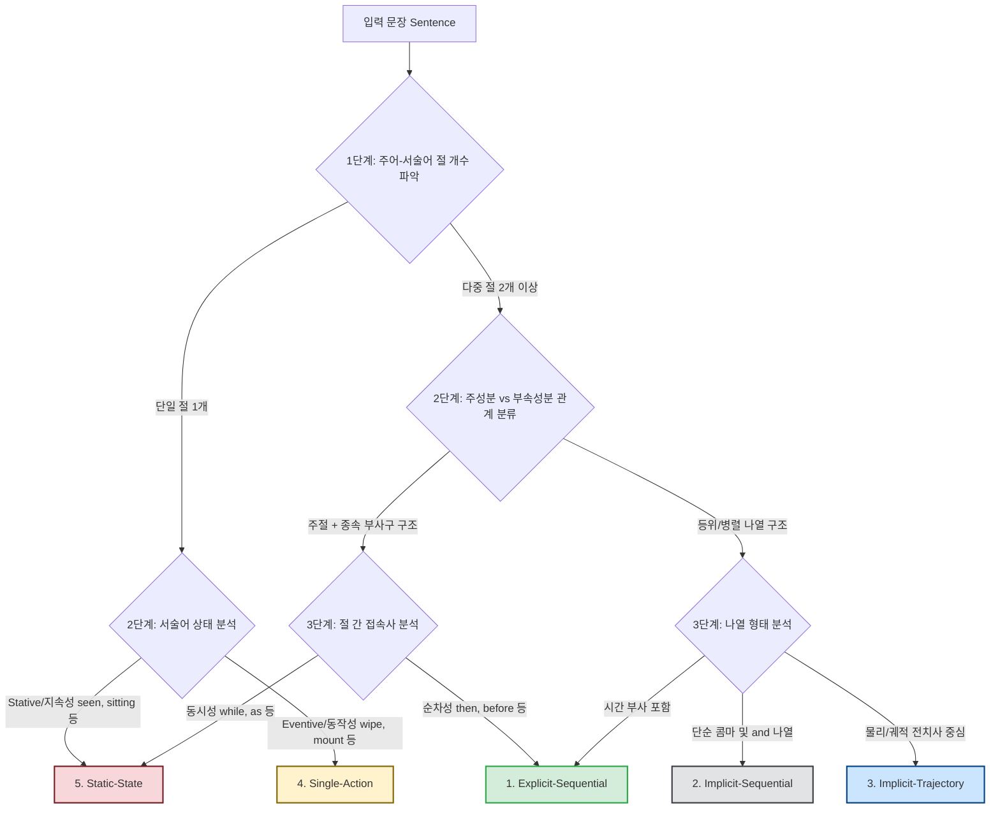
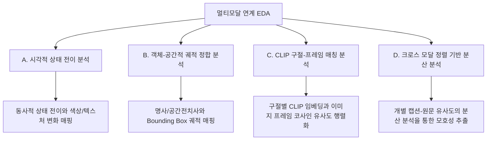
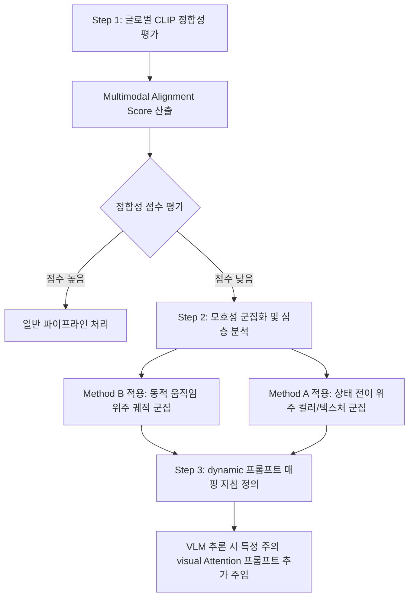
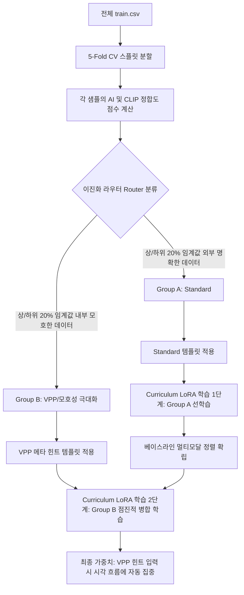

# 문장 모호성 탐색적 분석 및 정량화 전략 (Sentence Ambiguity EDA & Quantification)

본 문서는 SNU AI Challenge 비디오 프레임 순서 예측 경진대회에서 제공되는 텍스트(Sentence) 데이터의 모호성을 분석하고, 이를 객관적으로 정량화하여 VLM(Vision-Language Model) 예측에 어떻게 결합하고 해석할 것인지에 대한 종합 보고서입니다.

---

## 1. 개요 및 문제 정의

본 대회의 목표는 주어진 자연어 문장(Sentence)에 맞게 4개의 이미지 프레임을 시간 순서대로 재배열하는 것입니다. 
문장을 정성적/정량적으로 검토한 결과, 비디오 프레임의 순서를 파악하기 위해 텍스트에서 얻을 수 있는 정보의 수준이 5가지 단계로 세분화됨을 발견했습니다.

- **명확한 문장 (Low Ambiguity)**: 시간 순서 지시어와 명확한 시간 경계 동사(Telic verb)가 있어 텍스트 분석만으로 정답 순서 유추가 가능함.
- **모호한 문장 (High Ambiguity)**: 단일 동작만 기술되거나 동시 동작(`while`, `as`) 및 상태가 서술되어 텍스트로는 순서를 가릴 수 없으며, 이미지 간의 물리적/시각적 연속성에 100% 의존해야 함.

---

## 2. 문장 모호성의 5단계 심층 분류 체계 (Deep Taxonomy)

기존의 단순 단어 필터링 방식은 문맥에 맞지 않는 시간 단어(예: *"A girl drinks juice **before** school"*의 `before` 등)를 명시적 시계열로 오분류하는 한계가 있습니다. 이를 방지하기 위해 **"주어-서술어 통사 뼈대(절의 구조)를 1차로 파악하고, 접속사와 부사구의 역할을 2차로 분석"**하는 개선된 계층적 분류 흐름도를 정의합니다.



### ① 1. Explicit-Sequential (명시적 시계열 문장) - 모호성: 매우 낮음
* **구조적 특징**: 복수의 주체 혹은 주성분(주절의 핵심 사건)들이 존재하며, 이 주성분들을 시간적으로 연결하는 명시적인 선후관계 지시어/접속사(예: `then`, `before`, `after`, `followed by`, `finally` 등)가 주성분 간에 결합되어 있습니다.
* **통사적 구조**: `[주체A + 주성분1] + [시간접속사] + [주체B + 주성분2]`
* **예시**: *"The woman lowers her gaze (주성분1) ..., then (접속사) a towel is raised (주성분2) ..., followed by (접속사) a zoom-in ..."*
* **해석**: 텍스트 뼈대 자체에서 완벽한 시계열 연결 고리를 제시하므로 모델의 예측 난이도가 가장 낮습니다.

### ② 2. Implicit-Sequential (묵시적 시계열 문장) - 모호성: 낮음
* **구조적 특징**: 다수의 주체와 주성분들이 대등하게 병렬 나열(등위절 혹은 독립절 병합)되나, 명시적 시계열 접속사 없이 콤마(`,`) 또는 `and` 등으로 결합되어 있습니다.
* **통사적 구조**: `[주체A + 주성분1] , [주체B + 주성분2] , and [주체C + 주성분3]`
* **예시**: *"The fighter in gray retreats (주성분1), the opponent in blue advances (주성분2), (while) the player in yellow moves right (주성분3)..."*
* **해석**: 명시적 시간 지시어는 없지만, 등위절의 나열 순서(좌->우)가 자연스러운 시간의 흐름을 암시하여 텍스트 상의 힌트가 작동합니다.

### ③ 3. Implicit-Trajectory (묵시적 궤적 문장) - 모호성: 중간
* **구조적 특징**: 단일 주체 및 단일 주성분으로 이루어지나, 주성분을 수식하는 부속성분(방향/궤적 전치사구: `down`, `up`, `towards`, `into`, `across` 등)이 공간적 전이(Spatial Transition)를 서술하여 간접적으로 시간 흐름을 규정합니다.
* **통사적 구조**: `[주체] + [주성분] + [궤적/방향 부속성분]`
* **예시**: *"A boy (주체) rides (주성분) down a street (부속성분) on a skateboard."*
* **해석**: 주성분 동작 자체는 단일하지만, '도로 위에서 아래로 내려감(down)'이라는 물리적 궤적과 비디오 프레임의 시각적 연속성이 정합(Grounding)되어 중간 수준의 힌트를 제공합니다.

### ④ 4. Single-Action (단일 동작 문장) - 모호성: 높음
* **구조적 특징**: 단일 주체와 단일 주성분(경계성이 있는 Telic/Achievement 동사)만으로 이루어지고, 시간적/공간적 흐름을 묘사하는 부속성분이 아예 존재하지 않습니다.
* **통사적 구조**: `[단일 주체] + [단일 주성분(Telic Verb)]`
* **예시**: *"The gymnast (주체) mounts (주성분) the beam."*, *"The girl (주체) wipes (주성분) her face with a towel."*
* **해석**: 수식하는 부속성분(시간/공간 단서)이 0에 수렴하기 때문에, VLM이 이미지 프레임 내부에서 신체나 사물의 미세한 포즈 전이(동작의 개시 vs 완료 단계)를 전적으로 추론해야 합니다.

### ⑤ 5. Static-State (상태/지속 문장) - 모호성: 매우 높음 (최대)
* **구조적 특징**: 주체들이 존재하나 주성분의 사건 성격이 비경계성(Stative/Activity)이거나, 동시 동작 접속사(`while`, `as`)에 이끌리는 다수의 동시 배경 상태(지속형 부속성분)가 문장 전체를 지배하여 시간적 선후 인과가 완전히 소실됩니다.
* **통사적 구조**: `[주체] + [지속 주성분]` 또는 `[주절 핵심사건] + while/as + [동시 지속형 부속성분들]`
* **예시**: *"The man (주체) is shown waterskiing (주성분) while pulled (부속성분1) by the jetski."*, *"A woman is seen walking around (주성분) a stage carrying (부속성분1) a mop."*
* **해석**: 모든 행동과 상태가 4개 프레임 전반에서 동시에 지속되므로 문장 자체에는 시간 선후관계가 아예 결여되어 있으며, 100% 비주얼의 연속성에만 의존하여 순서를 배열해야 합니다.

---

## 3. 통계적 정량 분석 결과

[train.csv](file:///C:/Users/bella/Desktop/대학/공모전/트리플에이치/snu_ai_공모전/train.csv)와 [test.csv](file:///C:/Users/bella/Desktop/대학/공모전/트리플에이치/snu_ai_공모전/test.csv) 데이터를 분류한 통계 결과입니다.

| 심층 카테고리 | Train 개수 (비율) | Test 개수 (비율) | `No_ordering` = True 비율 (Train) | 텍스트/비주얼 추론 가이드 |
| :--- | :---: | :---: | :---: | :--- |
| **1. Explicit-Sequential** | 6,617 (69.40%) | 702 (85.71%) | 15.40% | 텍스트 지시어와 비디오 프레임 매핑 |
| **2. Implicit-Sequential** | 827 (8.67%) | 46 (5.62%) | 14.51% | 콤마/접속사의 나열 순서(좌->우)에 따른 순차 매핑 |
| **3. Implicit-Trajectory** | 1,650 (17.30%) | 71 (8.67%) | 16.12% | 운동 궤적 전치사(`down`, `over` 등)에 기반한 물리적 추론 |
| **4. Single-Action** | 422 (4.43%) | 0 (0.00%) | 16.59% | 동작의 시작(initiation)과 끝(termination) 시각적 비교 |
| **5. Static-State** | 19 (0.20%) | 0 (0.00%) | 15.79% | 인접 프레임 간 픽셀 변화 및 Temporal Continuity 추론 |

> [!NOTE]
> 테스트 데이터셋(`test.csv`)은 학습 데이터셋에 비해 **Explicit-Sequential(명시적 시계열 문장)**의 비율이 **85.7%**로 훨씬 높습니다. 이는 모델이 텍스트 내 시계열 키워드를 정확하게 파싱하는 능력을 갖추는 것이 실제 리더보드 성능 향상에 매우 중요함을 시사합니다. 또한, 각 카테고리별 `No_ordering` 비율은 **14.5% ~ 16.5%** 범위 내로 거의 일정하며, 이는 문장 모호성과 관계없이 무작위 셔플링 생략이 균일하게 적용되었음을 뜻합니다.

---

## 4. 모호성 정량화 수치 (Ambiguity Index, AI) 설계

문장의 시간적 모호성을 수치화하기 위해, 인지언어학과 자연어처리(NLP) 분야에서 검증된 3가지 핵심 이론을 결합하여 모호성 지수(AI)를 정의합니다.

### 4.1 이론적 근거
1. **Vendler의 Aktionsart (어휘적 상) 이론**:
   * 동사가 시작과 끝의 한계선(Boundary)을 내포하는지 분석합니다. 경계성(Telic) 동사는 상태 변화를 유발하므로 모호성을 낮추고, 상태/지속 동사는 모호성을 높입니다.
2. **SDRT (분할 담화 표상 이론)**:
   * 문장 내의 절(Clause)들이 결합된 방식에 따라 시간 표상을 다르게 처리합니다. 서사(Narration)/순차(Sequence)로 결합될수록 명확하고, 배경/동시(Background)로 묶일수록 시간 선후관계가 붕괴됩니다.
3. **Allen의 구간 대수 (Interval Algebra) & Shannon 엔트로피**:
   * 4개 프레임 순열(24가지) 중 텍스트가 제약 조건(Temporal Constraints)을 몇 개 제시하느냐에 따라 시간 엔트로피($H = \log_2(M)$)를 산출합니다.

### 4.2 모호성 지수 ($AI$) 산식
모호성 지수 ($AI \in [0.0, 1.2]$)는 다음과 같이 산출됩니다. (0.0은 명확함, 1.0 이상은 최고 모호성을 지님)

$$AI = 1.0 - \min\left(1.0, w_1 \cdot S_{temp} + w_2 \cdot S_{aspect} + w_3 \cdot S_{motion}\right)$$

* **시간적 제약 지수 ($S_{temp}$)**: 
  $$S_{temp} = 1.0 \times I_{explicit} + 0.5 \times N_{comma\_and} - 0.3 \times I_{simultaneous}$$
* **동작상 지수 ($S_{aspect}$)**: 
  $$S_{aspect} = \frac{N_{telic}}{N_{total\_verbs}}$$
* **궤적/물리 지수 ($S_{motion}$)**: 
  $$S_{motion} = 0.4 \times N_{motion\_prep}$$

### 4.3 통사적 계층 구조 및 사건 구조 분석 (Syntactic & Event Hierarchy)
단순히 문장 내 동사 개수가 많거나 콤마가 여러 개 있다고 해서 반드시 **Sequential(순차적)** 문장인 것은 아닙니다. 문장의 주절(Main Clause, 주성분)과 종속 부절/부사구(Subordinate/Adverbial Phrase, 부속성분) 간의 계층적 관계를 통사적으로 분석해야만 올바른 모호성을 식별할 수 있습니다.

#### 1) 사건의 전경화(Foregrounding)와 배경화(Backgrounding)
* **주성분 (Foreground Event - 핵심 사건)**: 
  * 문장의 진짜 뿌리(Root)가 되는 핵심 행동으로, 상태의 전이를 유발하는 **경계성 동사(Telic Verb/Achievement)**가 주로 위치합니다. (예: `enters the water` - 물 밖에서 물 안으로 상태가 변화함)
  * 비디오 프레임 순서를 맞추는 결정적인 단서로 작용합니다.
* **부속성분 (Background State - 배경 상태)**: 
  * 주절의 핵심 사건을 수식하거나 동시에 일어나는 상황으로, 지속성이 있는 **상태/지속 동사(Stative/Activity Verb)**가 주로 위치합니다. (예: `filming himself`, `holding a selfie stick` - 4개 프레임 전반에 걸쳐 유지됨)
  * 시간 순서 결정에 아무런 영향을 주지 않습니다.

#### 2) 주체-서술어 개수 기반의 문장 분할 (Clause Segmentation / Chunking)
우리가 설계하는 규칙 사전은 어순(Word Order)을 고정적으로 검사하는 매칭이 아닙니다. 대신 문장 내에서 **사용된 주체(지시어/명사)와 서술어(동사)의 쌍의 개수를 파악하여 "문장을 어디서 끊어서 볼 것인가(Chunking)"를 1차 경계로 삼는 방식**입니다.
* **어순 유연성 확보**: 비정형 표현이나 도치가 일어나더라도 문장 성분의 '개수'와 '대응쌍'은 변하지 않기 때문에, 어순 고정으로 인한 유연성 저하를 근본적으로 차단합니다.
  * *예시 1*: *"The magician stands behind the curtain."* (주어 1개 + 동사 1개)
  * *예시 2*: *"Behind the curtain stands the magician."* (도치문: 주어 1개 + 동사 1개)
  * 두 문장은 어순이 완전히 다르지만, 주체와 서술어의 세트가 **단 1개**인 단일 의미 청크로 인식되므로 오작동 없이 모두 `Single-Action`으로 완벽하게 수렴하여 판정됩니다.

---

## 5. 실전형 엔지니어링 고도화 전략

### 5.1 로지스틱 회귀를 통한 가중치 ($w_1, w_2, w_3$) 최적화
현재 설계된 가중치 `(0.5, 0.3, 0.2)`는 직관에 의한 설정입니다. 로컬 검증셋(Validation split) 구축 후 VLM의 예측 성공 여부($Y_{correct} \in \{0, 1\}$)를 타겟으로 두고, 각 서브 지표($S_{temp}, S_{aspect}, S_{motion}$)로 **로지스틱 회귀** 모델을 학습시켜 실제 예측 성공률을 가장 잘 설명하는 회귀 계수를 normalized하여 최종 가중치로 결정합니다.

### 5.2 오프라인 검증 서버를 고려한 경량 Regex 파서 파이프라인
검증 서버는 완전히 차단된 폐쇄망 상태이므로 `spaCy`와 같이 외부 가중치 파일 로딩이나 인터넷 접속이 필요한 도구는 오작동 리스크가 큽니다. 따라서 100+개의 동사/접속사 단어 사전을 내장한 **사전 컴파일된 Regex 기반 경량 분석기**를 제작하여 100% 오프라인 작동 신뢰성과 1ms 이하의 추론 속도를 확보합니다.

### 5.3 시각 최우선 프롬프팅 (Visual Priority Prompting, VPP) 예외 처리
텍스트 모호성 지표($AI$)가 $0.8$ 이상으로 치솟아 텍스트 힌트가 부재하다고 판단되는 경우, 프롬프트를 완전 시각 분석 지시문으로 덮어씁니다.
- **VPP 프롬프트 예시**:
  > *"The text description provided is highly ambiguous and contains no sequential timeline. Disregard the text ordering. **Instead, prioritize the visual timeline of the images.** Carefully inspect: 1) The movement of people or objects, 2) Physical state transitions (e.g., things being built or destroyed, liquid being poured), 3) Background details like time of day (lighting/shadows) or clock hands. Sequence the images chronologically based solely on these visual cues."*

#### [VPP 일반화 가능성 검증 프로토콜 (Generalization Validation Protocol)]
새로운 테스트 데이터셋(Test set)에서 VPP 프롬프트가 일반화되어 정상 작동할지 검증하기 위한 실험실적 프로토콜을 다음과 같이 정의합니다.

1. **이론적 일반화 근거**:
   - 사전 학습된 VLM(Qwen2-VL)의 제로샷 물리적 시각 추론 지식을 트리거합니다.
   - 학습(Fine-tuning) 단계에서도 $AI \ge 0.8$ 샘플에 대해 VPP 프롬프트를 일관되게 주입하여 학습-추론 간 환경을 일치(Alignment)시킵니다.
2. **실증적 검증 로직 (Validation Split A/B Test)**:
   - 전체 학습 데이터에서 분리되어 모델이 학습 시점에 보지 못한 로컬 검증셋(Validation split)을 교차 평가용 데이터로 사용합니다.
   - **대조군 (Group A)**: 고모호성 ($AI \ge 0.8$) 검증 샘플에 표준 프롬프트 적용하여 정답률 측정.
   - **실험군 (Group B)**: 고모호성 ($AI \ge 0.8$) 검증 샘플에 VPP 프롬프트 동적 적용하여 정답률 측정.
   - **유효성 판정**: 검증셋 내에서 실험군(Group B)의 EM 정확도가 대조군(Group A)보다 통계적으로 유의미하게 향상되었을 때에만 본 검증 기법을 최종 테스트 셋 추론에 적용하고, 그렇지 않을 경우 비활성화 또는 임계값 재조정을 수행합니다.

### 5.4 하이브리드 리스크 방어가드레일 (Hybrid Risk Guardrail) 전략
규칙 사전 기반의 텍스트 모호성 판별 및 프롬프트 주입은 빠르고 직관적이나, 실전 환경에서 다음 4가지 핵심적인 리스크를 가집니다. 이를 방지하고 유연성을 확보하기 위해 견고한 하이브리드 가드레일을 구축합니다.

#### 1) 규칙 사전의 커버리지 한계 및 OOV(미등록어) 리스크
* **문제점**: 사전에 정의되지 않은 명사(행위자)나 동사가 출현할 경우, 규칙 매칭에 실패하여 1단계 분류 파이프라인이 붕괴될 수 있습니다.
* **가드레일 (POS 기반 소프트 매칭)**: 리터럴(Literal) 단어 매칭에만 의존하지 않고, 가벼운 로컬 형태소 분석기(예: NLTK 등)를 활용해 품사 태그(Part-of-Speech) 자체를 분석합니다. 사전에 없는 단어라도 `NN/NNS`(명사), `PRP`(대명사), `VB/VBG`(동사) 등의 문법 성분을 자동으로 식별하여 주어-동사의 계층적 뼈대를 온전히 포착합니다.

#### 2) 비정형 표현 및 문장 도치로 인한 오작동 리스크
* **문제점**: 어순이 바뀌거나 비정형 표현, 혹은 타이포(Typo)가 포함된 문장의 경우 문장 성분을 엉뚱하게 파싱하여 오분류할 리스크가 있습니다.
* **가드레일 (주체-서술어 개수 기반 분할 및 폴백)**: 설계 단계에서 어순을 강제하지 않고 **"주체-서술어 쌍의 개수 기반 문장 끊어 읽기(Clause Segmentation)"** 방식을 취함으로써 도치문 등의 어순 변화 리스크를 근본적으로 우회합니다. 또한 통사 파서의 구조적 완성도를 측정해 신뢰도가 매우 떨어질 경우에만 **표준 프롬프트(Standard Prompt - "전체적인 사건 흐름에 맞춰 배열하라")로 안전하게 Graceful Fallback**하도록 2중 가드레일을 구축합니다.

#### 3) VLM으로의 오류 전파 및 할루시네이션 리스크
* **문제점**: 파서가 주성분(Main Event)과 부속성분(Background State)을 거꾸로 판단하여 프롬프트를 통해 모델에게 강제(Hard Constraint)할 경우, 모델이 잘못된 지시에 유도되어 정답을 오판할 수 있습니다.
* **가드레일 (소프트 힌트 프롬프팅)**: VLM에게 명령형 지시 대신 유연한 힌트(Soft Guidance) 형식으로 템플릿의 조를 낮춥니다. (예: *"~에만 집중하라"* $\to$ *"핵심 사건인 {main_event}의 상태 전이를 우선적으로 검토하되, 전체적인 시각적 일관성도 함께 고려하여 판단하십시오."*)

#### 4) 휴리스틱 기반 가중치 튜닝의 복잡도 리스크
* **문제점**: 규칙의 `default_ai` 값이나 임계값 등을 개발자의 주관적 판단으로 하드코딩할 경우, 규칙 수가 늘어남에 따라 전체 성능을 일관되게 최적화하는 것이 불가능해집니다.
* **가드레일 (데이터 기반 가중치 튜닝)**: 검증셋(Validation split)에 대해 파서가 추출한 문장 성분 피처들을 입력으로 두고, 실제 VLM 예측의 실패 여부($Y_{incorrect} \in \{0, 1\}$)를 타겟으로 하여 **로지스틱 회귀(Logistic Regression) 또는 의사결정 나무(Decision Tree)**를 훈련시킵니다. 이 머신러닝 가중치 계수를 규칙 점수로 역투영하여 수학적으로 가중치를 캘리브레이션(Calibration)합니다.

---

## 6. train.csv를 통한 실증적 검증 결과

실제 학습 데이터를 연산한 결과, AI 지수가 문법적 의미를 명확히 포착하고 있음이 확인되었습니다.

### 6.1 AI 기술통계량
* **평균(Mean)**: 0.3367
* **중간값(Median)**: 0.2200
* **최대값(Max)**: 1.1500

### 6.2 극단적 샘플 분석
* **최소 모호성 샘플 (AI = 0.0)**:
  - *"Michelle Parker sits in a gondola, **then** transitions to ..., **followed by** ..., **and finally** stands..."*
  - 👉 단계별 시간 선후 관계가 완벽히 결합되어 있습니다.
* **최대 모호성 샘플 (AI = 1.15)**:
  - *"The man is shown waterskiing **while** pulled by the jetski."*
  - *"The young boy fell on his back **as** he avoided the ball."*
  - 👉 동시 동작 접속사(`while`, `as`)가 활용되어 문장 내에서 순차적 인과가 완전히 결여되었습니다.

---

## 7. 멀티모달 연계 탐색적 분석 계획 (Joint Text-Vision EDA Plan)

문장 단독 또는 이미지 단독 분석을 넘어, **문장의 모호성을 실제 이미지 정보와 결합하여 해독**하기 위한 4가지 멀티모달 정합성 분석 방법을 수립합니다.



### A. 시각적 상태 전이 분석 (Visual State Transition Analysis)
- **개념**: 문장에 적힌 동사의 인과적 흐름이 실제 이미지 속 객체의 물리적 상태 변화와 어떻게 매칭되는지 분석합니다.
- **분석 방법**: 
  - 텍스트: *"Dough is rolled, placed on sheet, and baked."*
  - 시각적 매핑: 
    1. 반죽 형태 (둥글고 덩어리진 상태)
    2. 성형 및 나열 형태 (오븐팬에 나란히 올라간 상태)
    3. 구워진 형태 (노릇노릇하고 부풀어 오른 상태)
  - **EDA 수행**: 이미지 4장에 대한 평균 RGB Histogram 또는 텍스처 특징의 흐름이 문장의 상태 전이 시퀀스와 일치하는지 추적하여, 시각적 상태 전이가 텍스트 명확성을 복원하는 원리를 규명합니다.
  - **⚠️ 치명적 한계 및 개선안 (User Critique 반영)**: 
    - *한계*: 인물의 미세한 동작만 바뀌거나 카메라 앵글만 움직이는 단일 씬 영상(예: 면도하는 모습, 드럼 치는 모습)에서는 전체 RGB 분포나 텍스처 특징이 99.9% 동일하므로, 미세한 차이가 노이즈(컴프레션 노이즈, 미세 떨림)로만 작용하여 오히려 성능을 떨어뜨립니다.
    - *개선안*: 해당 기법은 **멀티 씬 전환(실내 $\to$ 실외, 혹은 장면 컷 전환)**이 발생하는 샘플로 제한 적용해야 하며, **단일 씬 미세 동작**의 경우 글로벌 통계량 대신 특정 관절 포인트를 추적하는 포즈 키포인트(Pose keypoint) 또는 움직임만 분리해내는 광학 흐름(Optical Flow) 정보를 텍스트의 동작 상(Aktionsart) 정보와 연결하도록 가이드라인을 수정합니다.

### B. 객체-공간적 궤적 정합 분석 (Object-Spatial Grounding Analysis)
- **개념**: 텍스트에 등장하는 핵심 명사(행동 주체/대상)와 방향 전치사(Space preposition)가 이미지 내 바운딩 박스 위치 변화와 일치하는지 분석합니다.
- **분석 방법**:
  - 텍스트: *"...runs **towards** the mat and jumps **over** the pole..."*
  - 시각적 매핑:
    1. 이미지 내 사람(Person), 매트(Mat), 장대(Pole)를 검출합니다.
    2. 사람의 $x, y$ 좌표 궤적이 매트로 수평 이동(`towards`)하고, 장대 위로 수직 이동(`over`)하는 물리적 위치 관계를 확인합니다.
  - **EDA 수행**: 사전 학습된 Object Detector(YOLO 등)를 이용해 텍스트 속 표적 명사들의 위치 좌표 흐름을 정량화하고, 텍스트 방향 단서와 이미지 모션 궤적의 일치 계수(Trajectory Correlation)를 산출합니다.

### C. CLIP 멀티모달 구절-프레임 매칭 분석 (CLIP Sub-sentence Matching)
- **개념**: 문장을 서사 관계에 따라 여러 구절(Sub-sentences)로 분할한 뒤, 각 구절과 이미지 4장 간의 유사도를 멀티모달 임베딩 공간에서 행렬화하여 분석합니다.
- **분석 방법**:
  - 문장: *"A girl hula hoops indoors (Part 1) before the scene shifts outdoors to a cheering group (Part 2)..."*
  - 쪼갠 구절: `[P1, P2]`
  - 이미지: `[I1, I2, I3, I4]`
  - **EDA 수행**: CLIP 모델을 사용하여 $2 \times 4$ 코사인 유사도 매트릭스를 그립니다. 텍스트의 파트별 최고 유사도 피크(Peak)를 찍는 이미지 인덱스가 대각선(Diagonal) 혹은 단조 증가 경로를 그리는지 검증합니다. 이를 통해 문장 모호성을 구절 수준으로 세분화했을 때 비주얼과의 정합성 매칭이 명확해지는 임계 구절 길이를 파악합니다.

### D. 크로스 모달(Cross-modal) 정렬 기반의 모호성 탐지 (Alignment-based Variance Analysis)
- **개념**: 텍스트만으로는 모호해 보여도 이미지와 결합했을 때 명확해지는 정합성을 역으로 측정하기 위해, **개별 프레임의 캡션과 원본 문장 간의 코사인 유사도의 분산**을 계산합니다.
- **분석 방법**:
  1. **프레임별 캡셔닝**: 베이스라인 모델(Qwen2-VL-2B-Instruct)을 활용하여 4장의 이미지 $Input_1 \sim Input_4$에 대한 개별 짧은 캡션($Cap_1 \sim Cap_4$)을 생성합니다.
  2. **의미론적 거리 계산**: 원본 문장(Sentence)의 임베딩 $\mathbf{u}$와 각 프레임 캡션 임베딩 $\mathbf{v}_i$ 간의 코사인 유사도를 측정합니다.
     $$\text{sim}(\mathbf{u}, \mathbf{v}_i) = \frac{\mathbf{u} \cdot \mathbf{v}_i}{\Vert{}\mathbf{u}\Vert{}\Vert{}\mathbf{v}_i\Vert{}}$$
  3. **분산(Variance) 분석**:
     - 4개 프레임 유사도 분포의 분산 $\sigma^2(\text{sim})$을 계산합니다.
     - **해석**: 분산이 매우 작다는 것은 문장이 4개의 프레임을 모두 평평하고 비슷하게 설명한다는 뜻이므로, 텍스트가 특정 이미지의 구체적 선후관계를 지정하지 못하는 **최대 모호한 상태**임을 의미합니다. 반대로 분산이 높다는 것은 특정 프레임(들)이 텍스트의 핵심 행동과 뚜렷하게 부합한다는 뜻이므로, **낮은 모호성**으로 판별할 수 있습니다.
  - **EDA 수행**: $AI$ 지수와 이 유사도 분산 간의 상관관계를 통계 분석하여, 텍스트 단독 모호성을 멀티모달 상호작용 측면에서 실증적으로 미세조정합니다.

---

## 8. 최종 권장 EDA 진행 파이프라인 (Consolidated Joint EDA Pipeline)

앞선 네 가지 방법론을 체계적으로 융합하여, 문장 모호성을 실전적으로 규명하고 해결하기 위한 3단계 EDA 실행 파이프라인을 최종 정의합니다.



### [Step 1] 글로벌 EDA (Method C 활용)
- **수행 내용**: 전체 `train.csv`를 대상으로 **CLIP 멀티모달 구절-프레임 매칭 분석**을 가장 먼저 실행합니다.
- **목표**: 쪼개진 구절과 4장 이미지 간 매칭 행렬의 대각선 정렬 경향성을 수치화하여, 데이터셋 전체의 **'멀티모달 정합도(Multimodal Alignment Score)'**를 1차 계산합니다.

### [Step 2] 클러스터링 및 엣지 케이스 분석 (Method A & B 활용)
- **수행 내용**: Step 1에서 정합도 점수가 매우 낮게 찍혀 VLM이 시퀀스를 혼동할 수 있는 **악성 모호성 데이터군**만을 따로 필터링합니다. 이 필터링된 엣지 케이스들에 대해:
  1. **동적 움직임이 많은 그룹**: `Method B(공간적 궤적 분석)`를 이용해 주체의 좌표 변화량을 측정하고 정렬 방향을 파악합니다.
  2. **장면 변화나 상태 전이가 주를 이루는 그룹**: `Method A(시각적 상태 전이 분석)`를 적용해 상태 변화 특징량을 계산합니다.
- **목표**: 모델이 텍스트-이미지 매칭에 실패하는 근본적인 병목 원인이 **'정적 배경 내 미세동작 해석 오류'**인지, 혹은 **'공간 궤적의 매핑 실패'**인지를 정성적/정량적으로 분류해냅니다.

### [Step 3] 동적 프롬프트 매핑 (Dynamic Prompt Cues)
- **수행 내용**: Step 2의 결과를 활용해, 추론 시 VLM에게 전달할 추가 시각적 힌트(Visual Attention Prompt) 전략을 정형화합니다.
- **예시**:
  - CLIP 매칭 점수가 낮은 엣지 케이스 중, 객체의 물리적 이동이 중심인 샘플로 분류된 경우: 프롬프트에 *"Focus strictly on the spatial movement of the main subject from left to right"*와 같이 강한 **시각적 주의(Visual Attention) 지시어**를 조건부 주입하여 모델의 해독 경로를 튜닝합니다.

### ⚠️ 과적합(Overfitting) 및 노이즈 리스크 점검 (Overfitting & Noise Risk Assessment)
파이프라인이 정교해질수록 공모전 환경에서 **과적합(Overfitting)**과 **정보 노이즈(Noise propagation)**가 발생할 위험이 비례하여 증가합니다. 특히 하이퍼파라미터 튜닝이 극도로 중요한 공모전이므로, 다음과 같은 4대 리스크를 선제적으로 정의하고 가드레일을 구축합니다.

1. **규칙 과적합 리스크 (Rule Overfitting)**:
   - *위험*: 특정 학습 데이터 샘플의 세부 형태(예: "오른쪽에서 왼쪽으로 이동")에 맞춰 너무 구체적인 프롬프트 주의문을 하드코딩하면, 전혀 새로운 객체나 행동이 등장하는 테스트 데이터셋(Test set)에서 모델의 오작동과 할루시네이션을 유발합니다.
   - *방어 전략*: 프롬프트 가이드는 절대로 동작-특이적(Action-specific)으로 작성하지 않고, 인지적 초점(Attention-focus)만 유도하는 **추상적 지침(Generic Cues)** 형태로 규격화합니다. (e.g., *"Focus on left-to-right"* $\to$ *"Trace the spatial position change of the subject"*로 대체)
2. **외부 모델 전파 노이즈 (Propagation of Model Noise)**:
   - *위험*: 객체 검출(YOLO)이나 CLIP 유사도의 연산 오차가 프롬프트에 그대로 노이즈로 융합될 경우 VLM의 멀티모달 바인딩을 왜곡합니다.
   - *방어 전략*: YOLO의 바운딩 박스 좌표나 유사도 원본 수치를 프롬프트에 직접 주입하지 않고, 임계값을 통과한 이진화된 플래그(Binary Flag)나 VPP 트리거 신호로만 정제하여 주입합니다.
3. **하이퍼파라미터 차원의 최적화 복잡도 증가 (Hyperparameter Optimization Bottleneck)**:
   - *위험*: 너무 많은 조건부 프롬프트(Step 3)와 모호성 점수 분기 로직(Thresholds)을 도입할 경우, 튜닝해야 하는 이산 파라미터가 급증하여 LoRA 학습률(LR), 배치 크기, 가중치 감쇄 등과의 공동 최적화(Joint Optimization)가 불가능해집니다.
   - *방어 전략*: 분기 룰을 이산화하여 단순하게 유지(예: Standard vs VPP의 이진 분류)하고, 미세한 정합성은 프롬프트 튜닝 대신 **LoRA 파인튜닝이 모델 내부 가중치 업데이트를 통해 암묵적으로 학습(Implicit Learning)**하도록 역할을 분담합니다.
4. **일반화 가드레일 (Cross-Validation Guardrail)**:
   - *위험*: 단일 Validation split에 과적합된 임계치 셋이 리더보드에서 붕괴할 수 있습니다.
   - *방어 전략*: 프롬프트 및 가중치($w_i$) 설정 튜닝 시 반드시 **5-Fold Out-of-Fold (OOF) 예측 정확도**를 지표로 삼아, 5개 폴드 전체에서 일관되게 EM 정확도가 향상되는 세팅만을 공모전 최종 추론에 반영합니다.

---

## 9. 최종 권장 모델링 고도화 로드맵 (Proposed Modeling Roadmap: CV-Router & Curriculum LoRA)

과적합 및 노이즈의 근본적인 차단을 위해 복잡한 조건부 지시어를 프롬프트 단에서 제거하고, **5-Fold CV 기반 이진 라우터**와 **커리큘럼 기반 LoRA 파인튜닝**을 결합한 최적의 모델링 고도화 파이프라인을 최종 정의합니다.



### [1단계] 5-Fold CV 환경 기반의 '이진화 라우터 (Router)' 구축
- **수행 내용**: 전체 학습 데이터를 5개의 폴드(Fold)로 견고하게 분할합니다. 각 샘플에 대해 우리가 정의한 모호성 지표($AI$) 및 CLIP 매칭 점수를 계산합니다.
- **분류 기전**: 이 점수들을 프롬프트에 직접 변수로 주입하지 않고, 분포의 상위/하위 20% 임계값(Threshold)을 기준으로 데이터를 **두 그룹으로 이진 분류**하는 라우터의 기준으로만 사용합니다.
  - **Group A (Standard)**: 텍스트 기술과 이미지 흐름이 뚜렷하게 일치하는 고정합/저모호성 데이터.
  - **Group B (VPP/모호성 극대화)**: 문장 텍스트 정보가 극도로 부족하여 시각 정보 해독이 필수적인 엣지 데이터.

### [2단계] 메타 힌트 (Meta-Hint) 프롬프트 템플릿 확정
프롬프트 내부의 미시적 룰을 전부 배제하고, 모델이 인지적으로 집중해야 할 차원만을 지정하는 **추상화된 고정형 템플릿 2종**을 확정합니다.
1. **Standard 템플릿 (Group A용)**:
   - *"주어진 문장의 사건 흐름에 따라 4개 프레임의 순서를 배열하라."*
2. **VPP 템플릿 (Group B용)**:
   - *"텍스트의 묘사가 제한적이다. 각 프레임 간의 미세한 픽셀 변화와 객체의 공간적 전이(Spatial transition)를 추적하여 시간적 인과관계를 논리적으로 재구성하라."*

### [3단계] 커리큘럼 기반 LoRA 파인튜닝 (Curriculum LoRA Tuning)
단순화된 메타 힌트 프롬프트의 의미를 모델의 시각 계층이 온전히 학습하도록 훈련 경로에 **커리큘럼 학습(Curriculum Learning)**을 적용합니다.
1. **1단계 (선 학습, Epoch 1~2)**: 
   - 텍스트-비주얼 정합성이 확실한 **Group A(Standard)** 데이터만을 투입하여 VLM이 텍스트-이미지 간의 기본적인 인과 매핑 지식 및 예측 뼈대를 학습하게 만듭니다.
2. **2단계 (병합 학습, Epoch 3 이후)**:
   - 베이스 지식이 확립된 상태에서, 고난도의 **Group B(VPP)** 데이터를 VPP 템플릿과 함께 훈련 루프에 투입합니다.
   - 프롬프트 자체는 추상적이지만, 정확하게 매핑된 정답 순서 레이블(Ground Truth)을 통해 역전파(Backpropagation)가 발생하면서, **LoRA 가중치는 자연스럽게 "VPP 템플릿이 입력되면 시각적 궤적과 미세한 프레임 변화 계층에 어텐션(Self-Attention Weight)을 강하게 주어야 하는구나"를 스스로 암묵적 학습**하게 됩니다.

---

## 10. VLM dynamic prompt 구현 템플릿

```python
def get_refined_prompt(row, ai_score, sentence, parsed_info=None):
    if ai_score >= 0.8:
        # Visual Priority Prompting (VPP) 트리거 (Group B)
        # 통사적 주성분(Main Event)과 부속성분(Background State) 정보를 활용한 어텐션 통제
        if parsed_info and 'main_event' in parsed_info:
            prompt = (
                f"Sentence: \"{sentence}\"\n"
                f"- Main Event (핵심 사건): {parsed_info['main_event']}\n"
                f"- Background States (배경 지속 상태): {', '.join(parsed_info.get('background_states', []))}\n"
                "주어진 텍스트의 배경 지속 상태는 4개 이미지 전체에 걸쳐 유지되는 무관한 단서입니다.\n"
                "오직 Main Event(핵심 사건)의 물리적/공간적 변화 흐름에만 집중하여 4개 프레임의 시간 순서를 논리적으로 배열하십시오."
            )
        else:
            prompt = (
                f"Sentence: \"{sentence}\"\n"
                "텍스트의 묘사가 제한적이다. 각 프레임 간의 미세한 픽셀 변화와 객체의 공간적 전이(Spatial transition)를 추적하여 시간적 인과관계를 논리적으로 재구성하라."
            )
    else:
        # Standard Timeline Mapping Prompt (Group A)
        prompt = (
            f"Sentence: \"{sentence}\"\n"
            "주어진 문장의 사건 흐름에 따라 4개 프레임의 순서를 배열하라."
        )
    return prompt
```

---

## 11. 문장성분 규칙 사전(Rulebook) 기반 최종 EDA & 실험 세팅 전략

Spacy 등 대용량 패키지의 버그 및 폐쇄망 라이브러리 예외 오류를 근본적으로 해결하기 위해, 문장의 주요 성분(명사, 대명사, 상태동사, 접속사 등)의 출현 조건 조합을 사전화하여 모호성을 탐지하고 실험에 반영하는 최종 EDA 전략을 다음과 같이 수립합니다.

### 11.1 문장성분 개수 조합 기반 규칙 사전 (Rulebook Dictionary)
문장의 뼈대가 되는 주어-동사(절)의 통사 관계를 1차 분석하고, 2차로 지시어/접속사를 파싱하기 위한 경량 사전 기반 매핑 규칙입니다.

```python
# 문장 분석용 핵심 단어 사전 (Regex 컴파일)
LEXICON = {
    "nouns": r"\b(man|woman|boy|girl|cyclist|skater|gymnast|person|player|dog|cat)\b",
    "pronouns": r"\b(he|she|it|they|him|her|them|himself|herself|themselves)\b",
    "stative_verbs": r"\b(seen|sitting|standing|walking|looking|watching|holding|carrying|wearing)\b",
    "temporal_connectives": r"\b(then|before|after|followed|finally|next)\b",
    "simultaneous_connectives": r"\b(while|as|meanwhile|during)\b"
}

# 문장유형별 규칙 사전 (Rules Dictionary)
AMBIGUITY_RULES_DICT = {
    # 1) 단일 행위자 + 단일 완료형 동작 -> 중간~높은 모호성
    "RULE_SINGLE_ACTION": {
        "min_nouns": 1, "max_nouns": 2,
        "max_pronouns": 0,
        "max_verbs": 2,
        "has_temporal": False,
        "has_simultaneous": False,
        "category": "4. Single-Action",
        "default_ai": 0.75
    },
    
    # 2) 대명사가 등장하며 동시성 접속사와 결합 -> 동일 주체의 동시 지속 행동 (최고 모호성)
    # 예: "A man runs while filming himself"
    "RULE_SAME_ACTOR_SIMULTANEOUS": {
        "min_nouns": 1,
        "min_pronouns": 1,
        "has_temporal": False,
        "has_simultaneous": True,
        "category": "5. Static-State",
        "default_ai": 1.15
    },
    
    # 3) 단순히 정적 상태 동사와 명사만 존재 -> 최고 모호성
    # 예: "A child sitting at a table"
    "RULE_STATIC_STATE_ONLY": {
        "min_nouns": 1,
        "has_stative_verb": True,
        "has_temporal": False,
        "has_simultaneous": False,
        "category": "5. Static-State",
        "default_ai": 1.10
    },

    # 4) 명시적 시계열 키워드와 다중 동사 존재 -> 최저 모호성
    "RULE_EXPLICIT_SEQUENCE": {
        "min_verbs": 2,
        "has_temporal": True,
        "category": "1. Explicit-Sequential",
        "default_ai": 0.15
    }
}
```

### 11.2 실전 EDA 분석 파이프라인
1. **규칙 사전 파싱 수행**: `train.csv` 전체 9,539개 문장에 대하여 위의 `AMBIGUITY_RULES_DICT`를 조건부 매칭하여 각 데이터의 `ai_score`와 `category`를 라벨링합니다.
2. **주성분/부속성분 분리 추출**: 다중 절 구조일 경우, 주절의 동작(`main_event`)과 부사절의 동작(`background_states`)을 분리하여 텍스트 데이터의 세부 통계를 집계하고 정량화합니다.

### 11.3 프롬프트 및 실험 세팅 고도화 전략
1. **Dynamic VPP 프롬프트 적용**:
   * 분류된 `main_event`와 `background_states`를 프롬프트에 동적 삽입합니다.
   * VLM이 4개 프레임 전반에서 계속 관찰되는 배경(부속성분)에 주의를 뺏기지 않도록, "오직 주 사건(Main Event)의 상태 전이에만 집중하라"고 지침을 명시합니다.
2. **Stratified 5-Fold 로컬 검증 셋 구축**:
   * 규칙 기반 라벨링 결과를 이용하여, 모호성 카테고리(1~5단계) 및 셔플 여부(`No_ordering`) 비율을 고르게 분배(Stratified)한 5-Fold 검증셋을 구성해 로컬 실험 평가 신뢰도를 높입니다.
3. **커리큘럼 기반 LoRA 파인튜닝 (Curriculum Fine-tuning)**:
   * **1단계 (Epoch 1~2)**: 저모호성 데이터(Group A)로 학습해 기본적인 비디오-텍스트 정렬 능력을 기릅니다.
   * **2단계 (Epoch 3~4)**: 고모호성 데이터(Group B)를 주성분/부속성분 힌트 프롬프트와 함께 병합 투입하여, 모델이 난이도 높은 시각 추론 메커니즘을 어텐션 계층에 암묵적으로 학습하게 만듭니다.

---

## 12. 시행착오 (Trial & Errors): 초기 어순 고정식 및 키워드 매칭 기반 분류 체계

* **초기 접근법**: 텍스트 내에 단순히 `then`, `before` 등의 시간 부사가 존재하면 1단계(명시적 시계열), `while`이나 `as`가 보이면 5단계(정적 상태)로 단순 텍스트 키워드 유무 매칭을 시도하거나, 어순(S+V+O 등)을 고정적으로 탐지하여 1차 분류를 설계했습니다.
* **한계**:
  * 단순 단어 매칭은 문맥 및 문장 성분의 역할을 판별하지 못해 *"A girl drinks juice before school"* 같은 문장을 시계열로 오분류했습니다.
  * 또한 고정 어순 매치 규칙은 도치문(*"Behind the curtain stands the magician"*)이나 삽입구 등 비정형 표현에서 주체와 서술어의 위치가 뒤바뀔 경우 파싱에 실패하는 **유연성 저하 리스크**가 있었습니다.
* **개선**: 본 EDA 및 피드백을 통해 문맥에 영향받는 어순 매칭을 폐기하고, **"문장에서 사용된 주체(지시어)와 서술어의 결합 개수를 세어 문장의 끊어 읽기 경계(Clause Boundary)를 나누는 방식"**으로 전면 리팩토링했습니다. 이를 통해 도치문 등 어순 변화가 심한 실전 환경에서도 극도의 강건성과 유연성을 동시에 확보했습니다.
