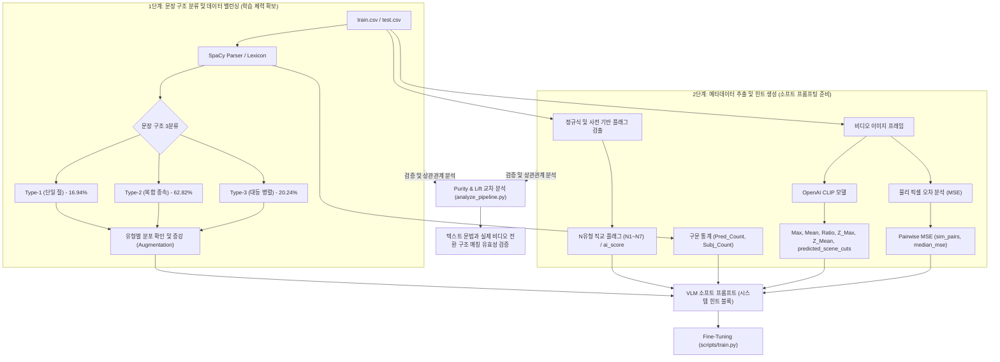

# 📋 VLM Sequence Ordering 파이프라인 설계 및 데이터 매핑 보고서

본 보고서는 **비디오 프레임 순서 정렬(Sequence Ordering)** 모델의 학습 성능 극대화를 위한 전처리 설계(1단계: 문장 구조 분류 및 데이터 밸런싱, 2단계: 메타데이터 추출 및 힌트 생성)가 저장소 내 어떤 스크립트 및 데이터셋 파일들과 매핑되어 구현되어 있는지 상세히 분석하고 정리합니다.

---

## 🛠️ [요약] 전체 파이프라인 및 데이터 매핑 매트릭스

---

## 1. 1단계: 문장 구조 분류 및 데이터 밸런싱 (학습 체력 확보)

문맥이나 어휘의 개별 의미에 종속되지 않고, 문장의 뼈대(구조)만을 기준으로 데이터를 나누어 VLM의 학습 균형을 유도하는 단계입니다.

### 🎯 전처리 목적
기존의 5단계 분류는 특정 클래스(Static-State)의 샘플 수(19개, 0.2%)가 너무 적어 모델 학습이 불가능했습니다. 이를 극복하고자 통사 구조(절 개수)를 기준으로 **상호배타적 3유형**으로 분할하여 학습 데이터의 균형을 맞추고 학습 체력을 확보합니다.

### 💻 관련 파일 및 코드 내부 매핑
* **[src/features/flag_detector.py](file:///C:/Users/송정현/Documents/Projects/SNU_AI_Challenge/src/features/flag_detector.py)**
  * **핵심 로직**: `classify_syntax_spacy(sentence)` 메서드
  * **동작**: SpaCy 영어 분석 트리(`token.dep_`)를 기반으로 부사절 종속(`advcl`, `ccomp`) 및 대등 연결(`conj` 관계이면서 품사가 동사인 토큰)을 검출해 문장을 **Type-1 (단일 절)**, **Type-2 (복합 종속)**, **Type-3 (대등 병렬)**로 상호배타 분류합니다.
* **[scripts/analyze_pipeline.py](file:///C:/Users/송정현/Documents/Projects/SNU_AI_Challenge/scripts/analyze_pipeline.py)**
  * **핵심 로직**: `classify_sentence(sentence)` 함수
  * **동작**: 문장 3유형 분류를 가동하여 학습 데이터셋 전체를 라벨링하고, 이를 `eda/sentence_type_labels.csv`로 출력합니다.
* **[count_3stage.py](file:///C:/Users/송정현/Documents/Projects/SNU_AI_Challenge/count_3stage.py) / [count_3stage_spacy.py](file:///C:/Users/송정현/Documents/Projects/SNU_AI_Challenge/count_3stage_spacy.py)**
  * **동작**: 각각 정규식 규칙 사전 및 SpaCy 기반으로 3유형을 분류하고 전체 데이터의 수량을 빠르게 집계합니다.
* **[eda_문장모호성.md](file:///C:/Users/송정현/Documents/Projects/SNU_AI_Challenge/eda_문장모호성.md) (결과 보고서)**
  * **검증 통계**: 전체 학습 데이터(`train.csv`, 9,535개) 전수 검증 결과 **Type-1 1,615개(16.94%)**, **Type-2 5,990개(62.82%)**, **Type-3 1,930개(20.24%)**의 분포를 확인하여 극심한 데이터 희소성을 해결하고 균형 잡힌 데이터 밸런싱을 수립했습니다.

---

## 2. 2단계: 메타데이터 추출 및 힌트 생성 (소프트 프롬프팅 준비)

사전(Lexicon), 정규식 및 이미지 모델을 사용해 다차원 특징들을 독립적으로 추출(Multi-label)하고, 이 특징들을 모델 프롬프트 내에 텍스트 형태의 [시스템 분석 힌트] 블록으로 제공하는 전처리 단계입니다.

### 🎯 전처리 목적
모델 구조를 쪼개어 강제하는 하드 라우팅 대신, VLM이 이미지를 관찰할 때 **어느 영역과 시점에 집중(Attention)해야 하는지 가이드해 주는 내비게이션 힌트를 주입**하여 순서 추론 정확도를 제고합니다.

### 💻 관련 파일 및 코드 내부 매핑

### A. 텍스트 힌트 (의미론적/통사적)
* **[src/features/flag_detector.py](file:///C:/Users/송정현/Documents/Projects/SNU_AI_Challenge/src/features/flag_detector.py) (어휘 사전 기반 플래그 검출)**
  * **핵심 로직**: `detect_flags(sentence)` 및 `calculate_ai_score` 메서드
  * **동작**: 정교한 정규식 단어 사전을 사용해 문장에 담긴 다양한 의미/담화 차원의 독립 플래그를 검출합니다.
    * **`N1_camera`**: 카메라의 구도나 촬영 지시어 (`camera`, `scene`, `zoom`, `pan`, `shot`, `cuts to`, `view shifts` 등)
    * **`N2_phase`**: 동작 시작/종료/지속 등 상적 국면 전이 동사 (`begin`, `start`, `continue`, `finish`, `stop`, `resume` 등)
    * **`N5_state_change`**: 착장이나 공간적 외형 상태 변화 표현 (`transitions from`, `changes into`, `now wearing`, `different outfit` 등)
    * 기타 플래그: `N3_script`(동작 동사), `N4_referential`(대명사 참조), `N6_iterative`(반복 동작), `N7_ordinal`(서수 표현)
    * **`ai_score`**: 1차 파티션 기본값에 위 플래그 가점/감점 수치를 더해 시간적 모호성 정도를 0.0 ~ 1.1 범위로 산출합니다.
* **[scripts/extract_features.py](file:///C:/Users/송정현/Documents/Projects/SNU_AI_Challenge/scripts/extract_features.py)**
  * **동작**: 위의 `OrthogonalFlagDetector` 모듈을 일괄 적용하여 `train.csv` 및 `test.csv` 전체 샘플에 N1~N7 플래그 및 `ai_score`가 포함된 피처셋 데이터셋을 새로 생성합니다.
* **[realtime_ambiguity_features.ipynb](file:///C:/Users/송정현/Documents/Projects/SNU_AI_Challenge/realtime_ambiguity_features.ipynb) (구문 통계량 추출)**
  * **핵심 로직**: `extract_ambiguity_features(sentence)` 함수
  * **동작**: SpaCy 구문 분석을 통해 문장의 핵심 구성 성분인 **주어 개수(`Subj_Count`)** 및 **서술어 개수(`Pred_Count`)**를 카운트하여 텍스트 힌트 정보로 가공합니다.
* **[eda_신규유형발굴.md](file:///C:/Users/송정현/Documents/Projects/SNU_AI_Challenge/eda_신규유형발굴.md) (결과 보고서)**
  * **검증 내용**: 기존 3단계 파티션 외에 왜 N1~N7 플래그가 독립적인 다차원 벡터(Multi-label) 구조여야 하는지 선행연구(TimeML, PDTB, VIST 등)에 근거해 타당성을 제시하고 실측 확률을 기록하고 있습니다.

### B. 시각 힌트 (물리적/의미적 장면 전이)
* **[eda/clip_labeling_model.py](file:///C:/Users/송정현/Documents/Projects/SNU_AI_Challenge/eda/clip_labeling_model.py)**
  * **핵심 로직**: OpenAI `CLIP (ViT-B/32)` 임베딩을 이용한 코사인 거리 계산 및 느슨한 장면 판정 알고리즘 (`map_similar_pairs_to_cuts`)
  * **동작**: 각 비디오의 프레임 간 코사인 유사도 점수를 계산하여 장면이 전환되는 수(`predicted_scene_cuts`)를 판정하고 표준 정규분포 Z-Score 점수(`Max_scaled`, `Mean_scaled`)를 구합니다.
  * **생성 데이터**: **[snu_clip_features.csv](file:///C:/Users/송정현/Documents/Projects/SNU_AI_Challenge/snu_clip_features.csv)** (전체 9,535개 비디오에 대해 `Id`, `predicted_scene_cuts`, `Max`, `Mean`, `Ratio`, `Z_Max`, `Z_Mean` 및 6쌍 거리 포함)
* **[scripts/compute_pairwise_mse.py](file:///C:/Users/송정현/Documents/Projects/SNU_AI_Challenge/scripts/compute_pairwise_mse.py)**
  * **동작**: 단순 픽셀 변화량(MSE) 기반으로 프레임 간 차이(`sim_pairs`, `median_mse`)를 구하는 물리적 시각 힌트 생성기입니다. (카메라 흔들림 등으로 인해 의미론적 CLIP 거리로의 고도화 작업이 수행되어 `snu_clip_features.csv`와 병용 또는 대체됩니다.)

---

## 3. 검증 및 브릿지 분석: Purity & Lift 교차 분석

* **[scripts/analyze_pipeline.py](file:///C:/Users/송정현/Documents/Projects/SNU_AI_Challenge/scripts/analyze_pipeline.py)**
  * **역할**: **1단계의 텍스트 분류** 결과와 **2단계의 비디오 구조 분류** 결과 간의 상관관계를 통계적으로 유효한지 측정하는 브릿지 코드입니다.
  * **주요 검증 분석**:
    * 텍스트 3유형(`Type-1~3`)과 비디오 유형(`sim_pairs` 기반 씬 구조) 간의 교차표(Crosstab)와 기저 확률 대비 상승도(Lift)를 연산합니다.
    * 카이제곱 독립성 검정(`chi2_contingency`) 및 Cramer's V 연산을 실행해 두 파트가 얼마나 의미있게 매치되는지 통계적으로 검증합니다.
    * 결과 리포트인 `eda/sentence_type_purity_report.md` 및 `mismatch_samples.csv`를 최종 출처로 남겨 파이프라인의 설계 건전성을 검증합니다.
