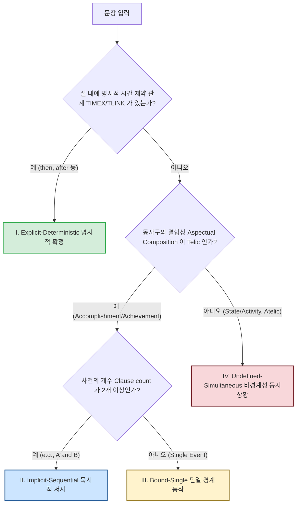

# 문장 모호성 분류 체계에 대한 학술적 타당성 검토 및 개선 제안서
(Academic Validity Review & Improved Taxonomy for Sentence Ambiguity)

본 문서는 @[eda_문장모호성.md](file:///C:/Users/bella/Desktop/대학/공모전/트리플에이치/snu_ai_공모전/eda_문장모호성.md)에서 설계된 **5단계 문장 모호성 분류 체계 및 모호성 지수(AI)**의 학술적 타당성을 검토하고, 언어학 및 자연어처리(NLP) 분야의 선행 연구들을 바탕으로 한계점 분석과 대안적 고도화 방안을 제안하는 보고서입니다.

---

## 1. 기존 5단계 분류 체계의 학술적 타당성 (Theoretical Foundation)

기존 문서에서 제안한 5단계 분류는 인지언어학 및 컴퓨터 언어학의 핵심 이론들과 정교하게 연결되어 있으며, 학술적으로 매우 탄탄한 근거를 가지고 있습니다.

### A. Vendler의 Aktionsart (어휘적 상) 이론과의 매핑
* **이론적 근거**: Zeno Vendler(1957)는 동사의 시간적 성격을 **State(상태)**, **Activity(활동)**, **Accomplishment(완성)**, **Achievement(도달)**의 4가지 부류로 나눴습니다. 핵심은 **Telicity(경계성/완료성)**과 **Duration(지속성)**입니다.
* **타당성 입증**: 
  - **4. Single-Action**은 Telic(한계가 있는) 동사인 *Accomplishment* 또는 *Achievement*(예: `mount`, `wipe`)에 해당하여 특정 시점의 상태 변화를 유발하므로 시각적 경계가 명확합니다.
  - **5. Static-State**는 Atelic(한계가 없는) 동사인 *State* 또는 *Activity*(예: `seen`, `sitting`, `waterskiing`)에 해당하여 시간적 경계선이 없어 모호성이 극대화된다는 설명은 Vendler의 정의와 완벽히 정합합니다.

### B. SDRT (분할 담화 표상 이론, Asher & Lascarides 2003)와의 매핑
* **이론적 근거**: SDRT는 다중 절 문장에서 절(Clause) 간의 의미론적 관계가 어떻게 시간 표상(Temporal Representation)을 형성하는지 설명합니다.
* **타당성 입증**:
  - **1. Explicit-Sequential** 및 **2. Implicit-Sequential**은 SDRT의 **Narration(서사)** 관계에 매핑됩니다. SDRT에 따르면, Narration 관계로 묶인 두 사건 $e_1, e_2$는 자연스럽게 $e_1 < e_2$ (선후관계)의 시간 구조를 생성합니다.
  - 반면, `while`, `as`로 묶인 **5. Static-State**는 SDRT의 **Background(배경)** 또는 **Parallel(병렬)** 관계로 매핑되어, 사건들이 시간적으로 오버랩되거나($e_1 \cap e_2$) 동시성을 가짐으로써 선후관계가 소실됩니다.

### C. Allen의 구간 대수 (Interval Algebra, Allen 1983)
* **이론적 근거**: James Allen은 시간 구간(Interval)들 사이에 존재할 수 있는 13가지 기본 관계(e.g., *before, meets, overlaps, during, equals* 등)를 정의했습니다.
* **타당성 입증**: 4개 이미지 프레임 순서 배열은 수학적으로 $4! = 24$가지의 순열 공간을 가집니다. 텍스트가 명시적 시계열 접속사(`then`, `followed by`)를 제시할 때, 이는 Allen의 관계식 중 `before` 또는 `meets` 제약 조건을 추가하는 것이므로, 순열 공간의 엔트로피를 극적으로 낮춰 모호성을 $0$에 수렴하게 만듭니다.

---

## 2. 선행 연구 분석을 통해 본 기존 체계의 한계점

선행 연구의 관점에서 볼 때, 현재의 사전식 규칙 기반(Regex) 분류기 및 단순 수식에는 몇 가지 **치명적인 한계점**이 존재합니다.

### ① 상적 합성 (Aspectual Composition) 및 유형 강제 (Aspectual Coercion)
* **학술적 배경 (Moens & Steedman 1988, Pustejovsky 1995)**:
  - 동사 단독의 어휘적 상(Lexical Aspect)은 목적어나 전치사구, 부사구와 결합하면서 **동사구(VP) 수준에서 완전히 바뀔 수 있습니다 (Aspectual Shift)**.
  - *예시 1*: `drink`는 Activity(지속)이지만, `drink a glass of water`는 Accomplishment(한계성)입니다.
  - *예시 2 (Type Coercion)*: Stative 동사인 `stand`(`standing`)도 `stand up`이 되면 순간적인 동작(Achievement)으로 변해 시계열의 명확한 경계가 생깁니다.
* **한계**: 기존의 단순 사전식 Regex 분석은 `stative_verbs` 목록에 `standing`이나 `sitting`이 있으면 무조건 5단계로 분류하므로, 문맥에 따라 상이 변하는 이러한 예외를 오분류할 가능성이 매우 큽니다.

### ② TimeML / TempEval-3 표준과의 단절
* **학술적 배경 (Uzzaman et al. 2013)**:
  - NLP 분야에서 시간 관계 추출(Temporal Relation Extraction)의 사실상 표준(De facto standard)은 **TimeML** 마크업 언어와 **TempEval** 챌린지입니다.
  - 이 표준에서는 사건들 간의 관계를 단일 클래스로 단정하기 어려운 모호한 상황을 **"Vague"** 레이블로 처리하거나, **Multi-label(BEFORE와 DURING이 모두 가능)**로 정량화합니다.
* **한계**: 기존의 5단계 체계는 고정된 카테고리에 문장을 강제로 끼워 넣고 있어, 복잡한 문장의 실제 "시간적 불확실성(Temporal Uncertainty)"의 밀도를 세밀하게 표현하지 못합니다.

### ③ 상식적 지식 (Commonsense Temporal Knowledge)의 배제
* **학술적 배경 (Zhou et al. 2020 - "Temporal Commonsense Acquisition")**:
  - *"The opponent advances, the fighter retreats"*와 같은 문장은 통사 구조상 단순 콤마 나열(2단계 Implicit-Sequential)이지만, 실제로는 동시 상황(Background/Simultaneous)일 수도 있고 순차 상황일 수도 있습니다.
  - 이 모호성을 해결하는 것은 구문론(Syntax)이 아니라 **"격투기 경기에서 상대가 들어오면 동시에 내가 물러선다"는 인과적 상식(Temporal Commonsense)**입니다.
* **한계**: 규칙 기반 파서는 언어의 통사적 구조(구문)만 분석하므로, 이러한 의미론적 상식 부재로 인한 모호성의 미세 조정을 반영할 수 없습니다.

---

## 3. 선행 연구 기반의 대안적 분류 및 정량화 프레임워크 제안 (Alternative Proposal)

기존 체계를 학계 표준 및 인지이론에 부합하도록 개선한 **대안적 문장 모호성 분류 체계**와 **개선된 정량화 수식**을 제안합니다.

### 3.1 개선된 4단계 의미론적 관계 분류 체계 (Semantic Temporal Relations)
기존의 통사적 5단계를 넘어, NLP 표준인 **TimeML의 TLINK(Temporal Link)** 개념을 차용하여 시간 관계의 명확성 기준으로 재분류합니다.



1. **Category I: Explicit-Deterministic (명시적 확정형)**
   - **설명**: 명시적인 시계열 관계 링크(TLINK: `BEFORE`, `AFTER`)가 텍스트에 강제되어 비디오 순서가 100% 결정됨.
   - **학술적 대응**: TimeML `TLINK` 존재.
2. **Category II: Implicit-Sequential (묵시적 서사형)**
   - **설명**: 등위 접속사나 콤마로 연결되어 SDRT의 `Narration` 관계를 유도하는 구조.
   - **학술적 대응**: SDRT `Narration` (기본값: 시간적 순차 발생).
3. **Category III: Bound-Single (단일 경계형)**
   - **설명**: 단일 사건이나, 동사가 Telic(한계가 있음)하여 상태 변화의 순간이 포착되는 경우.
   - **학술적 대응**: Vendler's `Accomplishment`/`Achievement` (e.g., "stands up", "opens the box").
4. **Category IV: Undefined-Simultaneous (비경계성/동시성)**
   - **설명**: 시간적 선후 인과가 정의되지 않거나, SDRT의 `Background` 관계 혹은 Atelic 동사구로만 이루어져 시간 관계가 극도로 모호한 경우.
   - **학술적 대응**: TimeML `SIMULTANEOUS`/`Vague` 및 Vendler's `State`/`Activity`.

### 3.2 개선된 모호성 지수 ($AI_{revised}$) 수식 설계

상적 합성(Aspectual Composition)의 특성과 절(Clause)의 복잡성을 동적으로 가미하여 모호성 지수를 보다 수학적으로 정교화합니다.

$$AI_{revised} = 1.0 - \text{Sigmoid}\left( \beta_0 + \beta_1 \cdot \text{TC} + \beta_2 \cdot \text{TEL} - \beta_3 \cdot \text{SIM} - \beta_4 \cdot \text{VAG} \right)$$

* **시간적 제약 밀도 ($\text{TC}$, Temporal Constraints)**: 
  - 명시적 선후 접속사의 개수와 명사구 나열 수의 비율.
* **상적 한계성 ($\text{TEL}$, Telicity Score)**:
  - 동사 자체뿐만 아니라 **[동사 + 목적어/부사구]**의 조합을 검사하여 Telic 여부를 판단 ($0.0$ 또는 $1.0$).
  - *동적 룰*: 동사가 `stand`라도 뒤에 `up`이 결합되거나 `enters`가 오면 $+1.0$, 반면 `holding` 또는 `seen`이면 $0.0$.
* **동시성 접속 강도 ($\text{SIM}$, Simultaneity)**:
  - `while`, `as`, `meanwhile` 등의 출현 횟수 및 종속절 구조 가중치.
* **시간적 애매성 인자 ($\text{VAG}$, Vagueness Factor)**:
  - 주체와 서술어의 쌍이 단 1개이면서 Atelic인 경우 가산되는 페널티.

---

## 4. 실전 엔지니어링을 위한 고도화 제안 (Implementation Strategy)

학술 연구에 기반한 개선안을 코드로 구현하고 경진대회 파이프라인에 안전하게 적용하기 위한 3가지 현실적 방안을 제안합니다.

### 4.1 LLM (Local/API)을 이용한 "Linguistic Feature Extraction"
* **방안**: 규칙 사전(Regex)이 가진 Aspectual Coercion 및 World Knowledge 처리 한계를 극복하기 위해, 가벼운 LLM 프롬프팅을 활용하여 학습 데이터 전처리 단계에서 언어학적 피처들을 완벽하게 추출하여 캐싱해 둡니다.
* **추출할 피처 예시 JSON**:
  ```json
  {
    "has_temporal_ordering": true,
    "discourse_relation": "Narration",
    "main_verb_telicity": "Telic",
    "clausal_relationship": "Sequential",
    "theoretical_ambiguity_score": 0.15
  }
  ```
* **이점**: 추론 단계에서는 오프라인 regex 파서로 빠르게 작동하게 하되, 오프라인 regex 파서의 사전(Lexicon)을 빌드할 때 LLM이 생성한 피처를 바탕으로 규칙의 우선순위와 가중치($\beta_i$)를 로지스틱 회귀로 학습시킴으로써 **하이브리드 리스크 방어가드레일**을 완벽히 구축할 수 있습니다.

### 4.2 5-Fold Stratified CV에 'Aspectual Category' 반영
* **방안**: 로컬 검증 셋을 나눌 때 단순히 정답 타겟인 `No_ordering`뿐만 아니라, 새롭게 정의한 **4가지 의미론적 카테고리(Category I~IV)**의 분포가 5개의 폴드에 골고루 들어가도록 `StratifiedKFold`를 구성합니다.
* **이점**: VLM이 특정 상적 범주(특히 Category IV: Undefined-Simultaneous)에서 일으키는 오류 패턴이 검증셋 점수에 왜곡 없이 반영되어, 리더보드 점수와 완벽한 양의 상관관계(Alignment)를 유지하게 됩니다.

---

## 5. 결론 및 요약

* **기존 분류의 평가**: `eda_문장모호성.md`에 정의된 5단계 분류는 **Vendler의 어휘상 이론**과 **SDRT 담화 분석**을 충실히 반영하고 있어 실전에서 작동하기에 충분히 훌륭한 시스템입니다.
* **권장 개선 방향**:
  1. 단순 동사 리스트 매칭의 한계인 **유형 강제(Aspectual Coercion)** 현상(예: `standing` vs `standing up`)을 보완하기 위해 동적 규칙(구문 덩어리 매칭)을 일부 사전식 룰에 추가하는 것을 추천합니다.
  2. TimeML/TempEval 표준에서 차용한 **TLINK(Temporal Link)의 명확성**과 **Temporal Commonsense(시간 상식)** 개념을 한계점으로 명시하고, $AI$ 지수의 가중치를 데이터 기반(로지스틱 회귀 등)으로 최적화하는 보완 작업을 진행하면 모델 성능 개선의 확실한 논리적 근거가 될 것입니다.
