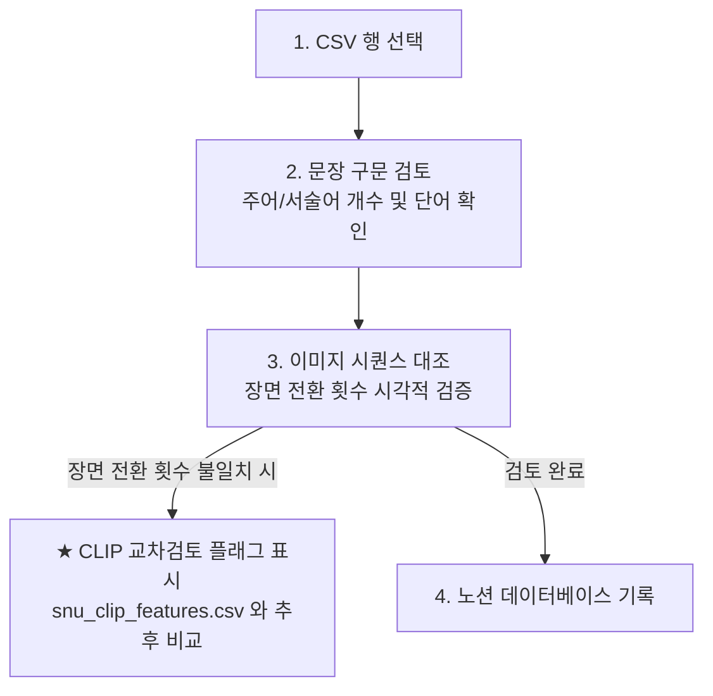

# 📊 [데이터 검토 가이드] VLM 데이터셋 주어/서술어 및 장면 전환 검증 가이드

이 페이지는 노션(Notion)에 붙여넣어 팀원들과 공유하고 데이터셋 수동 검토(Manual Inspection)를 진행하기 위한 가이드라인입니다.

---

## 🎯 1. 검토 목적 (Objective)
* **VLM 학습 데이터 무결성 검증**: SpaCy로 추출한 구문 정보(`주어 개수`, `서술어 개수`)와 이미지 시퀀스의 물리적 특징(`장면 전환 횟수`)이 의미론적으로 일치하는지 사람의 눈으로 교차 검증합니다.
* **엣지 케이스 및 오류 플래그 수집**: 자동화 파이프라인에서 발견하지 못한 구문 분석 오류와 장면 전환 불일치 케이스를 기록하여 추후 모델 튜닝의 노이즈를 제거합니다.

---

## 📂 2. 검토 대상 및 도구 (Resources)
1. **`train_검토_완료.csv`**: 주어/서술어 단어 및 개수, 장면 전환 횟수가 정제되어 최종 완성된 CSV 파일.
2. **이미지 데이터 (Input_1 ~ Input_4)**: 4장의 시간 순서 프레임 이미지 파일.
3. **`snu_clip_features.csv`**: 이미지 간의 유사도 점수와 CLIP 임베딩 변화량이 기록된 비교 분석용 파일 (장면 전환 불일치 시 참조).

---

## 🔍 3. 핵심 검토 프로세스 (Step-by-Step)

### 1단계: 📝 문장 구문 분석 검토 (Syntactic Check)
* **주어/서술어 단어 및 개수 검증**:
  * CSV의 `주어`, `서술어` 단어와 `주어 개수`, `서술어 개수`가 문법적으로 타당한지 확인합니다.
  * `[unspecified subject]`(생략된 주어)로 마스킹된 경우, 실제 문장에서 주어가 생략된 것이 맞는지 확인합니다.
* **체크 포인트**:
  * 구문 분석이 모호하거나 잘못 잡힌 경우 노션 데이터베이스에 **[구문 오류]** 태그를 지정하고 올바른 주어/서술어를 비고란에 메모합니다.

### 2단계: 🖼️ 이미지 전환 매칭 검토 (Scene Transition Check)
* **장면 전환 횟수와 이미지 대조**:
  * 4장의 이미지 시퀀스(`Input_1` ~ `Input_4`)를 시간 순서대로 직접 보면서, 화면 전환(Cut)이 일어나는 횟수를 시각적으로 카운트합니다.
  * 이 시각적 횟수가 CSV에 기록된 `장면 전환 횟수`와 일치하는지 비교합니다.
* **체크 포인트**:
  * 물리적으로 화면이 전환되었으나 카운트되지 않았거나, 카메라 움직임(Pan/Zoom)을 화면 전환으로 오인한 경우 **[장면 전환 오류]** 태그를 지정합니다.

### 3단계: ⚡ 장면 전환 오류 발생 시 대처 방안 (★ CLIP 교차검토 예약)
* **상황**: 시각적으로 확인한 화면 전환 횟수가 CSV에 표기된 `장면 전환 횟수`와 일치하지 않는 경우.
* **대처**:
  1. 노션 검토 표에 **`CLIP_Check = TRUE`** (또는 'CLIP 교차검토 대상') 플래그를 체크합니다.
  2. 추후 **`snu_clip_features.csv`** 파일을 열어, 해당 영상 아이디(ID)의 프레임 간 코사인 유사도(Cosine Similarity) 값과 임계값(Threshold)을 대조하여 물리적인 픽셀 변화량이 왜곡되었는지 원인을 분석하기 위함입니다.
  3. 비고란에 `(예: 3프레임과 4프레임 사이 컷 전환 누락, CLIP 임계값 재검토 필요)`와 같이 상세 의견을 남깁니다.

---

## 📋 4. 노션 검토 작업 템플릿 (Notion Database Schema)

노션 페이지에 테이블(표) 또는 데이터베이스를 생성하여 아래 항목으로 데이터를 기록해 나갑니다.

| ID (영상 아이디) | Sentence (문장) | 구문 검토 결과 | 장면 전환 일치 여부 | CLIP 교차검토 대상 | 비고 및 검토 의견 |
| :--- | :--- | :---: | :---: | :---: | :--- |
| `01Xw0R` | A child swings across the monkey... | ✅ 정상 | ❌ 불일치 (실제 1회) | **🚨 대상 (CLIP 검토)** | snu_clip_features.csv 대조 필요 |
| `02Yt7B` | The dog moves left... | ⚠️ 모호 (주어 상속) | ✅ 일치 |  - | 주어 상속 구조 검토 완료 |
| `03Kz9P` | A close-up of a person. | ✅ 정상 (is shown) | ✅ 일치 |  - | 명사구 가상 동사 매핑 정상 |

---

> 💡 **검토 팁 (Tip)**
> * 문맥 파악이 난해하거나 통사 유형(`Partition`) 분류가 틀린 것 같은 경우에도 꼭 체크하여 기록해 주세요. 이 데이터셋은 최종 VLM 모델의 프롬프트 품질을 결정하는 아주 중요한 뼈대가 됩니다.
