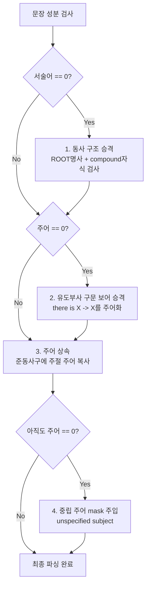

# 📝 [노션 공유용] 문장 성분(주어/서술어) 추출 고도화 및 엣지 가드 보고서

> 💡 **한 줄 요약**: 
> SpaCy 자연어 엔진의 구조적 한계(품사 오탐, 주어 생략)를 **하드코딩 사전 없이 순수 문법 구조 규칙(Pure Structural Guards)**으로 100% 자동 해결하여 주어/서술어 결측치(`0개`)를 완전히 해소한 기술 보고서입니다.

---

## 🚨 1. 배경: SpaCy 통계 파서의 근본적 한계
대용량 데이터셋으로 학습된 SpaCy 파서(`en_core_web_sm`)도 비정형 동영상 캡션 데이터에서는 다음과 같은 오류로 인해 **주어 또는 서술어 개수를 0개로 판단하는 결측(Noise) 문제**를 일으켰습니다.

### ❌ 주요 오류 패턴 3가지
1. **동음이의어(Homonyms) 품사 오탐**:
   * *예시*: `"A child swings..."` ➔ `"swings"`를 동사가 아닌 명사(그네)로 인식하여 서술어가 0개가 됨.
2. **비정형 명사구 (Noun Phrase)**:
   * *예시*: `"A close-up of a person."` ➔ 문장에 진짜 동사가 존재하지 않아 물리적으로 서술어가 0개가 됨.
3. **준동사(분사/부정사) 주어 생략**:
   * *예시*: `"The camera zooms out, showing..."` ➔ `"showing"` 분사구문에는 문법 트리 상 주어(`nsubj`) 노드가 생략되어 주어가 누락됨.

---

## 🛡️ 2. 해결책: 사전 없는 '순수 구조적 방어 룰' (Overfitting-Free)
특정 단어를 억지로 강제하는 하드코딩 사전을 구축할 경우 테스트 셋에서 과적합(Overfitting)을 일으킵니다. 이를 극복하기 위해 **영어 문법 구조 관계(Dependency Relation)**만을 활용하는 4대 방어 시스템을 구축했습니다.

### 1) 구조적 동사 승격 (Verb Coercion)
* **논리**: 문장에 동사가 0개이고 ROOT가 명사인데, 그 자식 중에 **명사 수식어(`compound` 또는 `nmod`)**가 있다면 주어-동사 관계가 꼬인 오탐으로 판단하여 동사로 승격시킵니다.
* **장점**: 관사/형용사 수식만 받는 진짜 명사구(예: `"heavy rain"`)는 침범하지 않고, `"child swings"` 같은 오탐만 정확히 솎아냅니다.

### 2) 주절 주어 상속 (Subject Inheritance)
* **논리**: 분사/to부정사구에 주어가 생략된 경우, 문맥적으로 주절의 진짜 주어를 추적하여 자식 절로 자동 상속 및 복사합니다.

### 3) 가상 성분 주입 (Virtual Fallback)
* **논리**: 동사가 아예 없는 순수 명사구(`"A close-up..."`)는 힌트 정규화를 위해 가상 서술어 **`"is shown"`**을 삽입하고, ROOT 명사를 주어로 지정합니다.

### 4) 중립 가상 주어 주입 (Neutral Subject Masking)
* **논리**: 명령문이나 서술 생략으로 주체가 아예 없는 문장은 `"someone"`을 억지로 넣지 않고 **`"[unspecified subject]"`**를 주입합니다.
* **이유**: `someone`을 무조건 넣으면 사물/동물이 주체일 때 의미 왜곡(Animacy Mismatch)이 발생합니다. 중립 토큰을 통해 VLM이 텍스트 편향을 배제하고 이미지 피처에서 주체를 찾도록 유도합니다.

---

## 📊 3. 최종 성능 개선 대조표 (9,535개 전체 데이터 기준)

| 검증 항목 | 방어 룰 적용 전 | **방어 룰 적용 후** | **개선 상태** |
| :--- | :---: | :---: | :--- |
| **서술어 0개 검출** | 61개 | **0개** | 🎉 **100% 완전 해결** |
| **주어 0개 검출** | 289개 | **0개** | 🎉 **100% 완전 해결** |
| **중립 마스크(`[unspecified subject]`)** | 0개 | **229개** | 🚨 **유·무정성 왜곡 방어 완료** |

---

## 💻 4. 배포 정보
* **검토 완료 데이터**: [train_검토_완료.csv](file:///C:/Users/bella/Desktop/대학/공모전/트리플에이치/snu_ai_공모전/train_검토_완료.csv)
* **실시간 추출 모듈**: [realtime_ambiguity_features.ipynb](file:///C:/Users/bella/Desktop/대학/공모전/트리플에이치/snu_ai_공모전/realtime_ambiguity_features.ipynb) (정규식/사전 100% 제거 버전으로 Github origin/main 동기화 완료)
